# w3.CSS Succinctly
## W3 Cascade Styles Sheet (CSS)

W3.CSS is a free, no-license CSS framework from w3schools.com that you can use to produce 
responsive websites that work across all common browsers (Chrome, Edge, Firefox, Internet 
Explorer) and devices (desktops, tablets, mobile). It is much smaller than other frameworks 
and relies only on standard CSS. 

### W3.CSS classes
All the classes in the W3.CSS framework begin with w3-, which reduces the likelihood of 
conflicting style names. You can combine multiple class names in a single class statement, 
allowing you to provide the basic CSS class and add additional features to it. For example, 
the following code will create a w3 container, and set its background color to blue-gray. 

#### Code Listing 1

```
<div class="w3-container w3-blue-gray"> 
</div> 
```
 
You could add the class w3-round-large to add rounded corners to the &lt;div&gt; element.

### PPP - Practice, Practice, Practice by cellardoor.bauska.org
### from W3.CSS Succinctly

> <b>By</b>
>
> <b>Joseph D. Booth</b>
>
> Foreword by Daniel Jebaraj
> Copyright © 2018 by Syncfusion, Inc.
> 2501 Aerial Center Parkway
> Suite 200
> Morrisville, NC 27560
> USA
> All rights reserved.

<b>Important licensing information. Please read.</b>

This book is available for free download from <a href="http://www.syncfusion.com/">
www.syncfusion.com</a> on completion of a registration form.

If you obtained this book from any other source, please register and download a free copy 
from <a href="http://www.syncfusion.com/">www.syncfusion.com</a>

This book is licensed for reading only if obtained from <a href="http://www.syncfusion.com/">
www.syncfusion.com</a>

This book is licensed strictly for personal or educational use.

The authors and copyright holders provide absolutely no warranty for any information provided.

The authors and copyright holders shall not be liable for any claim, damages, or any other 
liability arising from, out of, or in connection with the information in this book.

Please do not use this book if the listed terms are unacceptable.

Use shall constitute acceptance of the terms listed.

SYNCFUSION, SUCCINCTLY, DELIVER INNOVATION WITH EASE, ESSENTIAL, and
.NET ESSENTIALS are the registered trademarks of Syncfusion, Inc.

<b>Technical Reviewer:</b> James McCaffrey

<b>Copy Editor:</b> Courtney Wright

<b>Acquisitions Coordinator:</b> Tres Watkins, content development manager, Syncfusion, Inc.

<b>Proofreader:</b> Jacqueline Bieringer, content producer, Syncfusion, Inc.

## [Table of Contents](#table-of-contents)

### [<b>The Story Behind the Succinctly Series of Books</b>](#ch1)
>#### 1.1 [<b>About the Author</b>](#ch1-1)
>#### 1.2 [<b>Chapter 1 Introduction</b>](#ch1-2)
>#### 1.3 [<b>CSS only</b>](#ch1-3)
>#### 1.4 [<b>Layers</b>](#ch1-4)
>#### 1.5 [<b>W3.CSS classes</b>](#ch1-5)
>#### 1.6 [<b>Simple example</b>](#ch1-6)
  - >##### 1.6.1 [<b>Source page</b>](#ch1-6-1)
>#### 1.7 [<b>Obtaining W3.CSS</b>](#ch1-7)

### [<b>Chapter 2 Layout</b>](#ch2)
>#### 2.1 [<b>CSS layout</b>](#ch2-1)
  - >##### 2.1.1 [<b>Classes summary</b>](#ch2-1-1)
>#### 2.2 [<b>CSS responsive</b>](#ch2-2)
  - >##### 2.2.1 [<b>Responsive layout</b>](#ch2-2-1)
  - >##### 2.2.2 [<b>General-width columns</b>](#ch2-2-2)
  - >##### 2.2.3 [<b>12-column responsive</b>](#ch2-2-3)
  - >##### 2.2.4 [<b>Show and hide columns</b>](#ch2-2-4)
>#### 2.3 [<b>CSS grid</b>](#ch2-3)
  - >##### 2.3.1 [<b>Column widths</b>](#ch2-3-1)
>#### 2.4 [<b>CSS display</b>](#ch2-4)
>#### 2.5 [<b>Summary</b>](#ch2-5)

### [<b>Chapter 3 Colors</b>](#ch3)
>#### 3.1 [<b>Basic CSS colors</b>](#ch3-1)
>#### 3.2 [<b>Color libraries</b>](#ch3-2)
>#### 3.3 [<b>Color themes</b>](#ch3-3)
  - >##### 3.3.1 [<b>Available themes</b>](#ch3-3-1)

### [<b>Chapter 4 Helper Classes</b>](#ch4)
>#### 4.1 [<b>CSS round</b>](#ch4-1)
  - >##### 4.1.1 [<b>Circle class</b>](#ch4-1-1)
>#### 4.2 [<b>CSS padding</b>](#ch4-2)
  - >##### 4.2.1 [<b>Numeric padding</b>](#ch4-2-1)
  - >##### 4.2.2 [<b>Size padding</b>](#ch4-2-2)
>#### 4.3 [<b>CSS margins</b>](#ch4-3)
>#### 4.4 [<b>CSS borders</b>](#ch4-4)
  - >##### 4.4.1 [<b>Basic borders</b>](#ch4-4-1)
  - >##### 4.4.2 [<b>Border colors</b>](#ch4-4-2)
  - >##### 4.4.3 [<b>Thick borders</b>](#ch4-4-3)
>#### 4.5 [<b>CSS sizing</b>](#ch4-5)
>#### 4.6 [<b>Summary</b>](#ch4-6)

### [<b>Chapter 5 Containers</b>](#ch5)
>#### 5.1 [<b>CSS accordions</b>](#ch5-1)
  - >##### 5.1.1 [<b>Accordion bars</b>](#ch5-1-1)
  - >##### 5.1.2 [<b>Building the sections</b>](#ch5-1-2)
  - >##### 5.1.3 [<b>Navigation</b>](#ch5-1-3)
>#### 5.2 [<b>CSS tabs</b>](#ch5-2)
  - >##### 5.2.1 [<b>Tab classes</b>](#ch5-2-1)
  - >##### 5.2.2 [<b>Building the tabs</b>](#ch5-2-2)
  - >##### 5.2.3 [<b>Building the sections</b>](#ch5-2-3)
  - >##### 5.2.4 [<b>Navigation</b>](#ch5-2-4)
  - >##### 5.2.5 [<b>Vertical tabs</b>](#ch5-2-5)
>#### 5.3 [<b>CSS cards</b>](#ch5-3)
>#### 5.4 [<b>CSS sidebar</b>](#ch5-4)
  - >##### 5.4.1 [<b>Basic sidebar</b>](#ch5-4-1)
  - >##### 5.4.2 [<b>Collapsible sidebar</b>](#ch5-4-2)
  - >##### 5.4.3 [<b>Slide content to right</b>](#ch5-4-3)
>#### 5.5 [<b>CSS panels</b>](#ch5-5)
>#### 5.6 [<b>Summary</b>](#ch5-6)

### [<b>Chapter 6 Visual Elements</b>](#ch6)
>#### 6.1 [<b>CSS notes</b>](#ch6-1)
  - >##### 6.1.1 [<b>Customizing the notes</b>](#ch6-1-1)
>#### 6.2 [<b>CSS alerts</b>](#ch6-2)

### [<b>Chapter 7 Text</b>](#ch7)
>#### 7.1 [<b>CSS fonts</b>](#ch7-1)
  - >##### 7.1.1 [<b>Print style</b>](#ch7-1-1)
>#### 7.2 [<b>Web fonts</b>](#ch7-2)
  - >##### 7.2.1 [<b>Installing the font</b>](#ch7-2-1)
>#### 7.3 [<b>Alignment</b>](#ch7-3)
>#### 7.4 [<b>Text features</b>](#ch7-4)
>#### 7.5 [<b>CSS code</b>](#ch7-5)

### [<b>Chapter 8 Menus</b>](#ch8)
>#### 8.1 [<b>CSS navigation</b>](#ch8-1)
  - >##### 8.1.1 [Basic structure</b](#ch8-1-1)
  - >##### 8.1.2 [Horizontal menu</b](#ch8-1-2)
  - >##### 8.1.3 [Menu items</b](#ch8-1-3)
  - >##### 8.1.4 [Navigation bar positions</b>](#ch8-1-4)
>#### 8.2 [Summary</b>](#ch8-2)

### [<b>Chapter 9 Tables and Lists</b>](#ch9)
>#### 9.1 [<b>CSS tables</b>](#ch9-1)
  - >##### 9.1.1 [<b>Basic table</b>](#ch9-1-1)
  - >##### 9.1.2 [<b>w3-table-all</b>](#ch9-1-2)
  - >##### 9.1.3 [<b>Hovering</b>](#ch9-1-3)
>#### 9.2 [<b>CSS lists</b>](#ch9-2)
  - >##### 9.2.1 [<b>Basic list style</b>](#ch9-2-1)
>#### 9.3 [<b>Summary</b>](#ch9-3)

### [<b>Chapter 10 Buttons and Labels</b>](#ch10)
>#### 10.1 [<b>CSS buttons</b>](#ch10-1)
  - >##### 10.1.1 [<b>Button variations</b>](#ch10-1-1)
>#### 10.2 [<b>CSS badges</b>](#ch10-2)
  - >##### 10.2.1 [<b>Badges within other elements</b>](#ch10-2-1)
>#### 10.3 [<b>CSS tags</b>](#ch10-3)
  - >##### 10.3.1 [<b>Customizing the tags</b>](#ch10-3-1)
>#### 10.4 [<b>Summary</b>](#ch10-4)

### [<b>Chapter 11 Forms</b>](#ch11)
>#### 11.1 [<b>Text boxes</b>](#ch11-1)
  - >##### 11.1.1 [<b>Text box options</b>](#ch11-1-1)
>#### 11.2 [<b>Option buttons</b>](#ch11-2)
>#### 11.3 [<b>Check boxes</b>](#ch11-3)
>#### 11.4 [<b>Select elements</b>](#ch11-4)
  - >##### 11.4.1 [<b>Adding labels</b>](#ch11-4-1)
>#### 11.5 [<b>Summary</b>](#ch11-5)

### [<b>Chapter 12 Animations</b>](#ch12)
>#### 12.1 [<b>Animating elements</b>](#ch12-1)
  - >##### 12.1.1 [<b>Directions</b>](#ch12-1-1)
  - >##### 12.1.2 [<b>Zooming</b>](#ch12-1-2)
  - >##### 12.1.3 [<b>Opacity</b>](#ch12-1-3)
>#### 12.2 [<b>Spinner</b>](#ch12-2)
>#### 12.3 [<b>Summary</b>](#ch12-3)

### [<b>Chapter 13 Modals</b>](#ch13)
>#### 13.1 [<b>Creating a modal dialog</b>](#ch13-1)
>#### 13.2 [<b>Displaying the modal</b>](#ch13-2)
  - >##### 13.2.1 [<b>Animating the display</b>](#ch13-2-1)
>#### 13.3 [<b>Closing the modal dialog</b>](#ch13-3)
>#### 13.4 [<b>Summary</b>](#ch13-4)

### [<b>Chapter 14 Images</b>](#ch14)
>#### 14.1 [<b>CSS Images</b>](#ch14-1)
  - >##### 14.1.1 [<b>Responsive images</b>](#ch14-1-1)
  - >##### 14.1.2 [<b>Image opacity</b>](#ch14-1-2)
  - >##### 14.1.3 [<b>Grayscale</b>](#ch14-1-3)
  - >##### 14.1.4 [<b>CSS slideshow</b>](#ch14-1-4)
  - >##### 14.1.5 [<b>Setting the images</b>](#ch14-1-5)
  - >##### 14.1.6 [<b>JavaScript code</b>](#ch14-1-6)
>#### 14.2 [<b>Summary</b>](#ch14-2)

### [<b>Chapter 15 W3.CSS Example Code</b>](#ch15)
>#### 15.1 [<b>Head section</b>](#ch15-1)
  - >##### 15.1.1 [<b>Font Awesome</b>](#ch15-1-1)
  - >##### 15.1.2 [<b>HTML entities</b>](#ch15-1-2)
  - >##### 15.1.3 [<b>Setting the font family</b>](#ch15-4)
>#### 15.2 [<b>Body section</b>](#ch15-2)
  - >##### 15.2.1 [<b>Sidebar</b>](#ch15-2-1)
  - >##### 15.2.2 [<b>Compose new mail</b>](#ch15-2-2)
>#### 15.3 [<b>Summary</b>](#ch15-3)

### [<b>Chapter 16 Versions</b>](#ch16)
>#### 16.1 [<b>CSS Pro</b>](#ch16-1)
>#### 16.2 [<b>CSS Mobile</b>](#ch16-2)

### [<b>Chapter 17 Summary</b>](#ch17)
>#### 17.1 [<b>Site</b>](#ch17-1)

[]{#_Toc157040 .anchor}The Story Behind the *Succinctly* Series of Books

> Daniel Jebaraj, Vice President Syncfusion, Inc. Microsoft platform.
> This puts us in the exciting but challenging position of alway s

> <b>Staying on the cutting edge</b>
>
> As many of you may know, Syncfusion is a provider of software
> components for the being on the cutting edge.
>
> Whenever platforms or tools are shipping out of Microsoft, which seems
> to be about every other week these days, we have to educate ourselves, quickly.

<b>Information is plentiful but harder to digest</b>

In reality, this translates into a lot of book orders, blog searches,
and Twitter scans.

While more information is becoming available on the Internet and more
and more books are being published, even on topics that are relatively
new, one aspect that continues to inhibit us is the inability to find
concise technology overview books.

We are usually faced with two options: read several 500+ page books or
scour the web for relevant blog posts and other articles. Just as
everyone else who has a job to do and customers to serve, we find this
quite frustrating.

#### The *Succinctly* series 

This frustration translated into a deep desire to produce a series of
concise technical books that would be targeted at developers working on
the Microsoft platform.

We firmly believe, given the background knowledge such developers have,
that most topics can be translated into books that are between 50 and
100 pages.

This is exactly what we resolved to accomplish with the *Succinctly*
series. Isn't everything wonderful born out of a deep desire to change
things for the better?

<b>The best authors, the best content</b>

Each author was carefully chosen from a pool of talented experts who
shared our vision. The book you now hold in your hands, and the others
available in this series, are a result of the authors' tireless work.
You will find original content that is guaranteed to get you up and
running in about the time it takes to drink a few cups of coffee.

<b>Free forever</b>

Syncfusion will be working to produce books on several topics. The books
will always be free.

Any updates we publish will also be free.

<b>Free? What is the catch?</b>

There is no catch here. Syncfusion has a vested interest in this effort.

As a component vendor, our unique claim has always been that we offer
deeper and broader frameworks than anyone else on the market. Developer
education greatly helps us market and sell against competing vendors who
promise to "enable AJAX support with one click," or "turn the moon to
cheese!"

<b>Let us know what you think</b>

If you have any topics of interest, thoughts, or feedback, please feel
free to send them to us at [succinctly-series@syncfusion.com].

We sincerely hope you enjoy reading this book and that it helps you
better understand the topic of study. Thank you for reading.

> Please follow us on Twitter and "Like" us on Facebook to help us
> spread the word about the *Succinctly* series!
<!--~~~~~~~~~~~~~~~~~~~~~~~~~~~~~~~~~~~~~~~~~~~~~~~~~~~~~~~~~~~~~~~~~~~~~~~~~~~~~~~~~~~~~~~~~~~~-->
<!--~~~~~~~~~~~~~~~~~~~~~~~~~~~ 04/05 twitter & facebook logos (xx) ~~~~~~~~~~~~~~~~~~~~~~~~~~~~-->
<p align="center">

&nbsp;&nbsp;&nbsp;

</p>

<h3 id="ch1-1">1.1 About the Author</h3>

Joseph D. Booth has been programming since 1981 in a variety of
languages, including BASIC, Clipper, FoxPro, Delphi, Classic ASP, Visual
Basic, Visual C#, and the .NET Framework. He has also worked in various
database platforms, including DBASE, Paradox, Oracle, and SQL Server.

He is the author of *GitHub Succinctly*, *Accounting Succinctly*,
*Regular Expressions Succinctly*, and *Visual Studio Add-Ins Succinctly*
from Syncfusion, as well as six books on Clipper and FoxPro programming,
network programming, and client/server development with Delphi. He has
also written several third-party developer tools, including CLIPWKS,
which allows developers to programmatically create and read native Lotus
and Excel spreadsheet files from Clipper applications.

Joe has worked for a number of companies including Sperry Univac,
MCI-WorldCom, Ronin, Harris Interactive, Thomas Jefferson University,
People Metrics, and Investor Force. He is one of the primary authors of
Results for Research (market research software), PEPSys (industrial
distribution software), and a key contributor to AccuBuild (accounting
software for the construction industry).

He has a background in accounting, having worked as a controller for
several years in the industrial distribution field, but his real passion
is computer programming.

In his spare time, Joe is an avid tennis player, practices yoga and
martial arts, and plays with his first granddaughter, Blaire.

<h3 id="ch1-2">1.2 Chapter 1 Introduction</h3>

W3.CSS is a free, no-license CSS framework from
<a href="http://www.w3schools.com/">w3schools.com</a> that you can
use to produce responsive websites that work across all common browsers
(Chrome, Edge, Firefox, Internet Explorer) and devices (desktops,
tablets, mobile). It is much smaller than other frameworks and relies
only on standard CSS. For example, many common frameworks (such as
Bootstrap and Foundation) offer both a CSS and JavaScript component. For
a comparison of uncompressed memory sizes, see Table 1.

<h6 align="center"><i>Table 1: Approximate framework sizes</i></h6>

<div align="center">

|                      | JavaScript (min)     | CSS(min)          |
|----------------------|----------------------|:-----------------:|
| <b>Bootstrap</b>     | 37 kb                | 119 kb            |
| <b>Foundation</b>    | 86 kb                | 60 kb             |
| <b>W3.CSS</b>        | N/A                  | 21 kb             |

</div>

While each framework has its own set of features and components, the
W3.CSS is small and simple to learn, and is a worthwhile contender to
consider when deciding on a CSS framework.

<h3 id="ch1-3">1.3 CSS only</h3>

Since W3.CSS is a CSS-only framework, there are no components, which
some of the other frameworks include. This means that while you can use
the framework to handle the appearance and responsive design elements of
your site, there is no JavaScript. Bootstrap, Foundation, and other such
frameworks are built with both CSS styling and JavaScript components. If
you need scripting functionality in your site, you should either build
it yourself using libraries like jQuery, or consider a larger framework.

<h3 id="ch1-4">1.4 Layers</h3>

A website consists of three layers, but only the data (or HTML) layer is
required. A user could possibly disable all scripting and CSS styling,
and the data should still be readable. CSS styling improves the look of
the site by providing the browser with a set of rules indicating how to
display HTML elements. Scripting (mostly JavaScript) adds interactive
features, such as table searching and sorting, and client size form
validation.

<h6 align="center"><i>Table 2: Website layers</i></h6>
<div align="center">

| Layer                 | Content                                   | Format                  |
| --------------------- | ----------------------------------------- | ----------------------- |
| <b>Data Layer</b>     | Text/images to display                    | HTML                    |
| <b>Presentation</b>   | Style rules to overwrite browser          | CSS                     |
| <b>layer</b>          | defaults                                  |                         |
| <b>Activity layer</b> | Scripting to provide interactivity to the | JavaScript, Typescript, |
|                       | site                                      | etc.                    |

</div>

Browsers have default rules indicating how to display HTML tags; your
custom CSS or CSS frameworks (such as W3.CSS) provide overrides for
these defaults. Everything in W3.CSS uses standard CSS styles, just
organized in a way to provide consistent layout and responsive design
(by wrapping some styles with a media/device query filter).

<h3 id="ch1-5">1.5 W3.CSS classes</h3>

All the classes in the W3.CSS framework begin with <b>w3-</b>, which
reduces the likelihood of conflicting style names. You can combine
multiple class names in a single <b>class</b> statement, allowing you to
provide the basic CSS class and add additional features to it. For
example, the following code will create a <b>w3</b> container, and set its
background color to blue-gray.

<h6 align="center"><i>Code Listing 1</i></h6>

```
<div class="w3-container w3-blue-gray">
</div>
```
You could add the class <b>w3-round-large</b> to add rounded corners to the
<b>&lt;div&gt;</b> element.

<h3 id="ch1-6">1.6 Simple example</h3>

The following example shows a simple webpage displaying an image and
some text in a container. You can resize your browser and the entire
page will adjust to the new size.

<!--~~~~~~~~~~~~~~~~~~~~~~~~~~~~~~~~~~~~~~~~~~~~~~~~~~~~~~~~~~~~~~~~~~~~~~~~~~~~~~~~~~~~~~~~~~~~-->
<!--~~~~~~~~~~~~~~~~~~~~~~~ 06. sample webpage, gettysburg address (xx) ~~~~~~~~~~~~~~~~~~~~~~~~-->
<p align="center">
  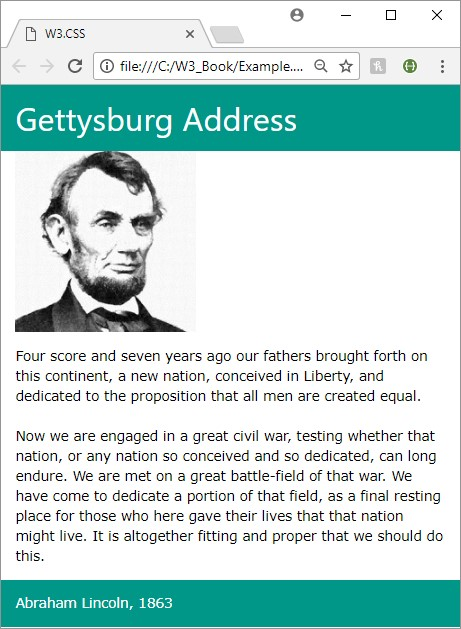
</p>
<!--  {width="2.091666666666667in" height="2.8538888888888887in"} -->

<h6 align="center"><i>Figure 1: Sample webpage</i></h6>

<!-- gettysberg address -->

<h4 id="ch1-6-1">1.6.1 Source page</h4>

Code Listing 1 is the source page for the above webpage. Note the
link-reference to local file <b>w3.css</b> in the <b>&lt;head&gt;</b> section of
the page. An alternative is to link to an external copy of the
framework, as I'll explain shortly.

<h6 align="center"><i>Code Listing 2: Sample W3.CSS page</i></h6>

```
<DOCTYPE html>
<html>
<head>
  <title>W3.CSS</title>
  <meta name="viewport" content="width=device-width, 
    initial-scale=1"> <link rel="stylesheet" href="w3.css">
</head>
<body>
  <div class="w3-container w3-teal">
    <h1>Gettysburg Address</h1>
  </div>
  <div class="w3-container">
    <p></p>
  </div>
  <div class="w3-container w3-round-large">
    <p>Four score and seven years ago our fathers brought forth on this 
      continent, a new nation, conceived in liberty, and dedicated to the
      proposition that all men are created equal.
    <br/><br/>
    <p>Now we are engaged in a great civil war, testing whether that nation,
      or any nation so conceived and so dedicated, can long endure. We are
      met on a great battle-field of that war. We have come to dedicate a
      portion of that field as a final resting place for those who here gave their
      lives so that that nation might live. It is altogether fitting and
      proper that we should do this. </p>
  </div>
  <div class="w3-container w3-teal">
    <p>Abraham Lincoln 1863</p>
  </div>

</body>
</html>
```

<h3 id="ch1-7">1.7 Obtaining W3.CSS</h3>

You can download <a href="https://www.w3schools.com/w3css/w3css_downloads.asp">W3.CSS</a>.
It is totally free and does not require any license to use.

You can also link to the W3.CSS library via an external link, using the
following snippet in your <b>&lt;head&gt;</b> section.
&lt;link rel="stylesheet" href="https://www.w3schools.com/w3css/4/w3.css"&gt;

The code in this book is based on W3.CSS version 4. Version 4 was
released in March of 2017, and is significantly faster than version 3.

<h2 id="ch2">Chapter 2 Layout</h2>

HTML elements on the screen all rely on the "box" model to display how
the element appears.

Each element is considered a box, with several styling options. Figure 2
shows the box model.
<!--~~~~~~~~~~~~~~~~~~~~~~~~~~~~~~~~~~~~~~~~~~~~~~~~~~~~~~~~~~~~~~~~~~~~~~~~~~~~~~~~~~~~~~~~~~~~-->
<!--~~~~~~~~~~~~~~~~~~~~~~~~~~~~~~~~~~~ 07. box model (xx) ~~~~~~~~~~~~~~~~~~~~~~~~~~~~~~~~~~~~~-->
<p align="center">
  
</p>
<!--  {width="2.6875in" height="2.0416666666666665in"} -->

<h6 align="center"><i>Figure 2: Box model</i></h6>

There are four parts to the box. The inner content is the default
content shown in the element. The height and width refer to that
content. The next layer is the padding, which is some number of pixels
wrapped around the content. The border is the third layer, wrapped
around the padding, and the final layer is the margin.
<!--~~~~~~~~~~~~~~~~~~~~~~~~~~~~~~~~~~~~~~~~~~~~~~~~~~~~~~~~~~~~~~~~~~~~~~~~~~~~~~~~~~~~~~~~~~~~-->
<!--~~~~~~~~~~~~~~~~~~~~~~~~~~~~~~~~~~~~~~ 08. note (xx) ~~~~~~~~~~~~~~~~~~~~~~~~~~~~~~~~~~~~~~~-->
<p align="left">
  
<!--  {width="0.25in" height="0.28958333333333336in"} -->
<i><b>Note: There is some confusion,
particularly with older browsers, as to what the width and height
actually represent. According to the W3C standards, the height and
width should represent the content only. However, Internet Explorer
calculated the width and height to include padding and border. The
default behavior is the content, so a 50 x 20 pixel content with 5
pixels padding and border takes up 70 x 30 pixels on the screen.</b></i></p>

You can use the <b>box-sizing</b> CSS style rule to set the width and
height to either <b>content-box</b> (default) or <b>border-box</b>. If you are
going to use <b>border-box</b>, I would recommend setting the rule on the
body tag, rather than individual elements. However, sticking with the
W3C standard is your best bet. If you need to support older versions of
Internet Explorer, or aren't sure which model is used by the users'
browsers, I would add the <b>box-sizing</b> rule and set it to
<b>contentbox</b>.

CSS gives you total control over the margin, border, and padding; you
can set them all to the same value or set different values for the
individual sides (left and right), top, and bottom. One of the benefits
of the W3 CSS framework is that the class definition sets them
consistently for you.

<h3 id="ch2-1">2.1 CSS layout</h3>

W3 uses two basic classes to display cell content, the <b>w3-cell-row</b>
class and the <b>w3-cell</b> class. The <b>row</b> element is a wrapper around
a collection of cells. The cells take up 100 percent of the row width
and are automatically adjusted based on their content. For example, take
a look at the following code snippet.

<h6 align="center">Code Listing 3</h6>

```
<div class="w3-cell-row">
  <div class="w3-container w3-red w3-cell">
    <p>John Smith</p>
  </div>
  <div class="w3-container w3-green w3-cell">
    <p>Lead developer and system architect on pipeline database project</p>
  </div>
</div>
```

This would produce the following appearance in the browser window. The
two cells take up 100 percent of the width, and the larger content would
take up more space.
<!--~~~~~~~~~~~~~~~~~~~~~~~~~~~~~~~~~~~~~~~~~~~~~~~~~~~~~~~~~~~~~~~~~~~~~~~~~~~~~~~~~~~~~~~~~~~~-->
<!--~~~~~~~~~~~~~~~~~~~~~~~~~~~ 09. row/cell appearance example (xx) ~~~~~~~~~~~~~~~~~~~~~~~~~~~-->
<p align="center">
  
</p>
<!--  {width="6.5in" height="0.3958333333333333in"} -->

<h6 align="center"><i>Figure 3: Row/cell appearance</i></h6>

One feature of the layout class is that the cell heights will match the
height of the largest content, so if the cell's description had much
more detail, it might appear as shown in Figure 4.
<!--~~~~~~~~~~~~~~~~~~~~~~~~~~~~~~~~~~~~~~~~~~~~~~~~~~~~~~~~~~~~~~~~~~~~~~~~~~~~~~~~~~~~~~~~~~~~-->
<!--~~~~~~~~~~~~~~~~~~~~~~~~~~~~ 10. same-height cells example (xx) ~~~~~~~~~~~~~~~~~~~~~~~~~~~~-->
<p align="center">
  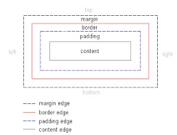
</p>

<!--  {width="5.302083333333333in" height="1.125in"} -->

<h6 align="center"><i>Figure 4: Same-height cells</i></h6>

You can adjust the alignment of the text within the cell using the
<b>w3-cell-top</b>, <b>middle</b>, or <b>bottom</b> classes. For example, if we
added the <b>w3-cell-bottom</b> class, the name <b>John Smith</b> would be
aligned to the bottom of the red cell in the previous example.

<h6 align="center"><i>Code Listing 4</i></h6>

```
<div class="w3-container w3-red w3-cell w3-cell-bottom">
  <p>John Smith</p>
</div>
```
The <b>w3-mobile</b> class can be added to a <b>w3-cell</b> as well. This will
cause the cells to be laid out horizontally on a larger screen, but be
stacked vertically on smaller screens, such as mobile devices (phones
and some tablets).

<h4 id="ch2-1-1">2.1.1 Classes summary</h4>

The following is a list of the various <b>w3</b> classes for controlling
your screen layout:

-   <b>w3-cell-row</b>: Starts a container row for a collection of cells.

-   <b>w3-cell</b>: Individual cell content within the row.

-   <b>w3-cell-top</b>: Aligns content to top of the cell.

-   <b>w3-cell-middle</b>: Centers content vertically within the cell.

-   <b>w3-cell-bottom</b>: Aligns content to bottom of the cell.

-   <b>w3-mobile</b>: Helper class added to cell; will display cell
    horizontally if there's room, but stack vertically on smaller
    devices.

<h3 id="ch2-2">2.2 CSS responsive</h3>

The W3.CSS framework includes a grid system designed to be responsive to
the screen size, rearranging columns as needed to render on different
devices. For example, let's look at a website that displays information
about U.S. coins. A sample is shown in Figure 5.

<!--~~~~~~~~~~~~~~~~~~~~~~~~~~~~~~~~~~~~~~~~~~~~~~~~~~~~~~~~~~~~~~~~~~~~~~~~~~~~~~~~~~~~~~~~~~~~-->
<!--~~~~~~~~~~~~~~~~~~~~~~~~~~~ 11. responsive website example (xx) ~~~~~~~~~~~~~~~~~~~~~~~~~~~~-->
<p align="center">
  
</p>
<!--  {width="5.580972222222222in" height="1.332638888888889in"} -->

<h6 align="center"><i>Figure 5: Responsive website example</i></h6>

When this screen is displayed on a mobile device, the layout will change
to stack the information vertically, as shown in Figure 6.
<!--~~~~~~~~~~~~~~~~~~~~~~~~~~~~~~~~~~~~~~~~~~~~~~~~~~~~~~~~~~~~~~~~~~~~~~~~~~~~~~~~~~~~~~~~~~~~-->
<!--~~~~~~~~~~~~~~~~~~~~~~~~~~ 12. mobile device display example (xx) ~~~~~~~~~~~~~~~~~~~~~~~~~~-->
<p align="center">
  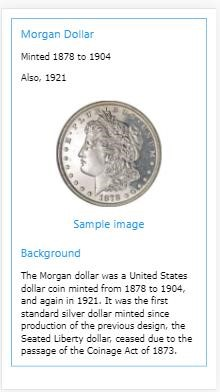
</p>
<!--  {width="1.3909722222222223in" height="2.4784722222222224in"} -->

<h6 align="center"><i>Figure 6: Mobile device display</i>

<h4 id="ch2-2-1">2.2.1 Responsive layout</h4>

To create the responsive layout, you must start with a <b>w3-row</b> or
<b>w3-row-padding</b> container.

<h6 align="center"><i>Code Listing 5</i></h6>

```
<div class="w3-row w3-border w3-border-blue w3-margin">
</div>
```

To be responsive, the elements must be nested with the <b>w3-row</b> class.
Within the <b>w3-row div</b>, you can add additional <b>div</b> containers to
create columns.

<h4 id="ch2-2-2">2.2.2 General-width columns</h4>

Here are the general column classes:

-   <b>w3-half</b>: Takes up half of the row width.

-   <b>w3-third</b>: Takes up one-third of the row width.

-   <b>w3-twothird</b>: Takes up two-thirds of the row width.

-   <b>w3-quarter</b>: Takes up one-fourth of the row width.

-   <b>w3-threequarter</b>: Takes up three-fourths of the row width.

The coin website code snippet is shown in Code Listing 6. The first two
columns (coin name and image) each take up one-fourth of the screen,
while the background column takes up half of the row width.

<h6 align="center"><i>Code Listing 6: Coin website</i></h6>

```
<div class="w3-row w3-border w3-border-blue w3-margin">
  <div class="w3-container w3-quarter">
    <h4 class="w3-text-blue">Morgan Dollar</h4>
    <p>Minted 1878 to 1904</p>
    <p>Also 1921</p>
  </div>
  <div class="w3-container w3-quarter w3-center">
    <p></p>
    <h4 class="w3-text-blue">Sample image</h4>
  </div>
  <div class="w3-container w3-half">
    <h4 class="w3-text-blue">Background</h4>
    <p>The Morgan dollar was a United States dollar coin minted from
      1878 to 1904, and again in 1921. It was the first standard silver
      dollar minted since production of the previous design, the Seated
      Liberty dollar, ceased due to the passage of the Coinage Act of
      1873.</p>
  </div>
</div>
```

<h4 id="ch2-2-3">2.2.3 12-column responsive</h4>

In addition to the general column widths, you can use the <b>w3-col</b>
class to create columns based on a 12-column grid. To do so, you need to
add the <b>w3-col</b> class, followed by the number of columns (based on
screen size). The size classes are:

-   <b>l1</b> -- <b>l12</b>: Number of columns on large screens (> 992 pixels).

-   <b>m1</b> -- <b>m12</b>: Number of columns on medium screens.

-   <b>s1</b> -- <b>s12</b>: Number of columns on small screens (< 601 pixels).

For example, the classes <b>w3-col</b>, <b>s6</b>, <b>m4</b>, and <b>l3</b> indicate
to use half the screen width on a small device, one-third of the screen
on a medium device, and one-fourth of the screen on a large device.

You can also set the width using the class <b>w3-col</b> and an inline
style to set the <b>width</b> attribute. There is also a <b>w3-rest</b> class
that indicates the column should take the remaining row width.

<h4 id="ch2-2-4">2.2.4 Show and hide columns</h4>

By default, all columns are visible on every device. However, that might
not be the best approach for your website. For our example, we might
want to skip the background column when viewing the site on a mobile
device. For a restaurant site, you might consider the directions column
critical when displaying the site on a mobile device, but hide it when
viewing the site on a desktop device.

We can do this by adding the appropriate class (<b>w3-hide-small</b>) from
the following list to the column we want to hide:

-   <b>w3-hide-small</b>: Don't show column on a small device.

-   <b>w3-hide-medium</b>: Don't show column on a medium-sized device.

-   <b>w3-hide-large</b>: Don't show column on a large device.

When we add <b>w3-hide-small</b> to the background column, the screen will
appear as shown in Figure 7 when viewed on a mobile device.

<h6 align="center"><i>Code Listing 7</i></h6>

```
<div class="w3-container w3-half w3-hide-small">
```

<!--~~~~~~~~~~~~~~~~~~~~~~~~~~~~~~~~~~~~~~~~~~~~~~~~~~~~~~~~~~~~~~~~~~~~~~~~~~~~~~~~~~~~~~~~~~~~-->
<!--~~~~~~~~~~~~~~~~~~~~~ 13. mobile display without background column (xx) ~~~~~~~~~~~~~~~~~~~~-->
<p align="center">
  
</p>
<!--  {width="1.5784722222222223in" height="1.812361111111111in"} -->

<h6 align="center"><i>Figure 7: Mobile display without background column</i></h6>

<h3 id="ch2-3">2.3 CSS grid</h3>

The framework's grid system works just as the responsive system (meaning
all columns must be contained with a <b>w3-row</b>), but relies on
<b>w3-col</b> and <b>sizing</b> (based on 12 columns) to determine the column
sizes.

<h4 id="ch2-3-1">2.3.1 Column widths</h4>

Each column is 8.33 percent (one-twelfth) of the container width, and
you can specify the number of columns to display for device sizes. If
nothing is specified for a particular device size, it is assumed to be
12 columns:

-   <b>s1</b> -- <b>s12</b>: Small (< 601 pixels)

-   <b>m1</b> -- <b>m12</b>: Medium

-   <b>l1</b> -- <b>l12</b>: Large (> 992 pixels)

Suppose we change our coin example to the following code snippet.

<h6 align="center"><i>Code Listing 8</i></h6>

```
<div class="w3-row w3-border w3-border-blue w3-margin">
  <div class="w3-container w3-col s3 m2 l1">
    <h4 class="w3-text-blue">Morgan Dollar</h4>
    <p>Minted 1878 to 1904</p>
    <p>Also 1921</p>
  </div>
  <div class="w3-container w3-col s3 m2 l1 w3-center">
    <p></p>
    <h4 class="w3-text-blue">Sample image</h4>
  </div>
  <div class="w3-container w3-col s6 m8 l10">
    <h4 class="w3-text-blue">Background</h4>
    <p>The Morgan dollar ... </p>
  </div>
</div>
```

You can see the column widths changing with the device size.
<!--~~~~~~~~~~~~~~~~~~~~~~~~~~~~~~~~~~~~~~~~~~~~~~~~~~~~~~~~~~~~~~~~~~~~~~~~~~~~~~~~~~~~~~~~~~~~-->
<!--~~~~~~~~~~~~~~~~~~~~~~~~~~~ 14. small size (< 601 pixels) (xx) ~~~~~~~~~~~~~~~~~~~~~~~~~~~~~-->
<p align="center">
  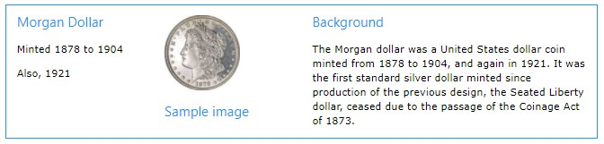
</p>
<!--  {width="2.6222222222222222in" height="1.6872222222222222in"} -->

<h6 align="center"><i>Figure 8: Small size (< 601 pixels)</i></h6>

<!--~~~~~~~~~~~~~~~~~~~~~~~~~~~~~~~~~~~~~~~~~~~~~~~~~~~~~~~~~~~~~~~~~~~~~~~~~~~~~~~~~~~~~~~~~~~~-->
<!--~~~~~~~~~~~~~~~~~~~~~~~~~~~~~~~~~~ 15. medium size (xx) ~~~~~~~~~~~~~~~~~~~~~~~~~~~~~~~~~~~~-->
<p align="center">
  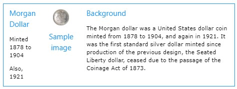
</p>
<!--  {width="4.335833333333333in" height="1.68125in"} -->

<h6 align="center"><i>Figure 9: Medium size</i></h6>

<!--~~~~~~~~~~~~~~~~~~~~~~~~~~~~~~~~~~~~~~~~~~~~~~~~~~~~~~~~~~~~~~~~~~~~~~~~~~~~~~~~~~~~~~~~~~~~-->
<!--~~~~~~~~~~~~~~~~~~~~~~~~~~~~ 16. large size (> 992 pixels) (xx) ~~~~~~~~~~~~~~~~~~~~~~~~~~~~-->
<p align="center">
  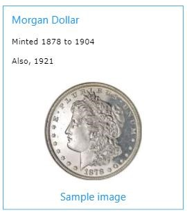 992 pixels)"
  alt="Large size (> 992 pixels)."
  style="border: 2px solid #000000; width:6.5in;" />
</p>
<!--  {width="6.5in" height="1.2083333333333333in"} -->

<h6 align="center"><i>Figure 10: Large size (> 992 pixels)</i></h6>

By setting the <b>w3-col</b> and appropriate sizing in the grid, you can
easily have your website adapt its appearance to the device size.

Note that you can also use the <b>w3-hide-size</b> classes to hide columns
on different devices; however, be sure to adjust your size classes to
avoid creating empty gaps. In our example code, if we wanted to hide the
description column on a small device, the previous two columns should
use <b>s6</b> sizing, rather than <b>s3.</b>

<h3 id="ch2-4">2.4 CSS display</h3>

The <b>w3-display-container</b> class allows you to display HTML elements
at specific locations within other elements. For example, you might want
to design a box where the close icon is always in the upper-right
corner, while the Save and Cancel options always appear in the lower
right. By using the <b>w3-display-container</b> class, you can position
elements using class names that represent relative positions with the
container.

Figure 11 shows where the class names place the elements within the
container.
<!--~~~~~~~~~~~~~~~~~~~~~~~~~~~~~~~~~~~~~~~~~~~~~~~~~~~~~~~~~~~~~~~~~~~~~~~~~~~~~~~~~~~~~~~~~~~~-->
<!--~~~~~~~~~~~~~~~~~~ 17. css display class names; top, middle, bottom (xx) ~~~~~~~~~~~~~~~~~~~-->
<p align="center">
  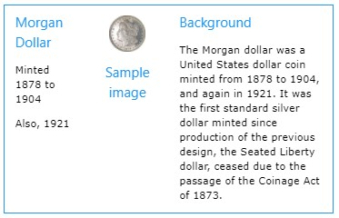
</p>
<!--  {width="4.635277777777778in" height="1.9416666666666667in"} -->

<h6 align="center"><i>Figure 11: CSS display</i></h6>

For example, if we want to create a Save dialog box, with the top-right
corner containing an X symbol to close the box, and the bottom middle
the Save and Cancel buttons, we could use the following code snippet.

<h6 align="center"><i>Code Listing 9</i></h6>

```
<div class="w3-display-container w3-margin w3-blue" style="height:250px">
  <div class="w3-display-topright w3-xxlarge">&times;</div>
    <div class="w3-display-bottommiddle">
      <button class="w3-btn w3-green w3-margin w3-border">Save</button>
	  <button class="w3-btn w3-red w3-margin w3-border">Cancel</button>
    </div>
  </div>
</div>
```

You can still use other classes, such as <b>w3-hide-size</b>, to customize
the appearance of a display container to different device sizes.

<h3 id="ch2-5">2.5 Summary</h3>

The W3.CSS framework provides a number of different layout options,
allowing a lot of flexibility in designing your web application.

<h2 id="ch3">Chapter 3 Colors</h2>

The W3.CSS framework simplifies color management by providing classes to
set the foreground and background colors of elements. The default color
scheme is based on the Material Design colors. The color classes
<b>w3-color</b> and <b>w3-text-color</b> can be applied to any element. There
are hover classes, <b>w3-hover-color</b> and <b>w3-hover-text-color</b>, which
can be applied when a user moves the mouse over an element.

<h3 id="ch3-1">3.1 Basic CSS colors</h3>

The basic color set available in the W3 framework is shown in the
following figure.
<!--~~~~~~~~~~~~~~~~~~~~~~~~~~~~~~~~~~~~~~~~~~~~~~~~~~~~~~~~~~~~~~~~~~~~~~~~~~~~~~~~~~~~~~~~~~~~-->
<!--~~~~~~~~~~~~~~~~~~~~~~~~~~~~~~~~~~ 18. w3.css colors (xx) ~~~~~~~~~~~~~~~~~~~~~~~~~~~~~~~~~~-->
<p align="center">
  
</p>
<!--  {width="4.239305555555555in" height="5.561111111111111in"} -->

<h6 align="center"><i>Figure 12: W3.CSS colors</i></h6>

You can apply colors simply by adding the class name to the list of
classes on the element. For example, the following container will have
white lettering on a blue background.

####&lt;div class="w3-container w3-blue w3-text-white"&gt; &lt;/div&gt;

You can apply colors to any HTML element, such as <b>&lt;div&gt;</b> or <b>&lt;table&gt;</b>.
<!--~~~~~~~~~~~~~~~~~~~~~~~~~~~~~~~~~~~~~~~~~~~~~~~~~~~~~~~~~~~~~~~~~~~~~~~~~~~~~~~~~~~~~~~~~~~~-->
<!--~~~~~~~~~~~~~~~~ 08.  (xx) ~~~~~~~~~~~~~~~~~-->
<p align="left">
  
<!--  {width="0.25in" height="0.28958333333333336in"} -->
<b><i>Note: Colors should be used carefully when designing a site---in particular, 
check for 508 compliance. The Web Content Accessibility Guidelines require a
4.5-to-1 contrast ratio between colors, to increase readability. For larger text 
sizes, 14 pixels and bold, or 18 pixels and larger, a 3.0-to-1 ratio is required. 
You should use tools such as <a href="https://webaim.org/resources/contrastchecker/">
this website </a> to check that color combinations meet these guidelines. People with
low vision or color-blindness will appreciate the effort.</i></b>
</p>

<h3 id="ch3-2">3.2 Color libraries</h3>

You can also download separate color libraries from the W3.CSS site.
Table 3 lists the libraries that are available.

<h6 align="center"><i>Table 3: Color libraries</i></h6>
<div align="center">

| Library Name           | Description                                  | Download name         |
| ---------------------- | -------------------------------------------- | --------------------- |
| <b>Color Flat UI</b>   | Bold, bright colors for simple interfaces.   | w3-colors-flat.css    |
| <b>Window Metro</b>    | Metro modern colors.                         | w3-colors-metro.css   |
| <b>Windows 8</b>       | Flat design and modern colors.               | w3-colors-win8.css    |
| <b>Highway Colors</b>  | Highway colors based on federal standards.   | w3-colors-highway.css |
| <b>Safety Colors</b>   | Safety colors based on federal standards.    | w3-colors-safety.css  |
| <b>European colors</b> | European traffic colors, RA Color Standards. | w3-colors-signal.css  |
| <b>Fashion colors</b>  | Fashion colors from Color Trends.            | w3-colors-2017.css    |
| <b>Vivid colors</b>    | Vibrant colors from ISCC-NBS standard.       | w3-colors-vivid.css   |
| <b>Food colors</b>     | Colors match foods, such as wine,            | w3-colors-food.css    |
|                        | tomatoes.                                    |                       |
| <b>Camouflage</b>      | Colors with earth tones, from federal        | w3-colors-camo.css    |
| <b>colors</b>          | standards.                                   |                       |

</div>

Note that the colors in the libraries all have unique names, so you can
use multiple color libraries, in addition to the standard material
design colors in the framework. Each color will begin with the final
portion of the name, such as <b>&lowbar;flat</b> or <b>&lowbar;signal</b>.

<h3 id="ch3-3">3.3 Color themes</h3>

Color themes are CSS classes that allow you to use variations of the
same basic color. For example, if your site has a gray look about it,
you can download the <b>w3-theme-grey.css</b> style sheet and include it in
your style sheet references.

This will add 12 additional color classes for text, default theme color,
and lighter/darker variations on theme.

<h6 align="center"><i>Table 4: Color themes</i></h6>
<div align="center">

| Style name           | Description                                                                 |
| -------------------- | --------------------------------------------------------------------------- |
| <b>w3-text-theme</b> | Text color, generally against white background.                             |
| <b>w3-theme</b>      | Default theme color.                                                        |
| <b>w3-theme-JS</b>   | Lightest variation of the theme background color (also w3-theme-light).     |
| <b>w3-theme-IX</b>   | Where x is 4 down to 1, progressively darker backgrounds, but still lighter |
|                      | than the default theme color.                                               |
| <b>w3-theme-d5</b>   | Darkest variation of the theme background color (also w3-theme-dark).       |
| <b>w3-theme-dX</b>   | Where x is 4 down to 1, progressively lighter theme backgrounds, but still  |
|                      | darker than the default theme color.                                        |

</div>

The following figure shows a sample theme (blue-gray) to illustrate the appearance of 
themes.
<!--~~~~~~~~~~~~~~~~~~~~~~~~~~~~~~~~~~~~~~~~~~~~~~~~~~~~~~~~~~~~~~~~~~~~~~~~~~~~~~~~~~~~~~~~~~~~-->
<!--~~~~~~~~~~~~~~~~~~~~~~~~~~~ 19. w3 text themes (blue-gray) (xx) ~~~~~~~~~~~~~~~~~~~~~~~~~~~~-->
<p align="center">
  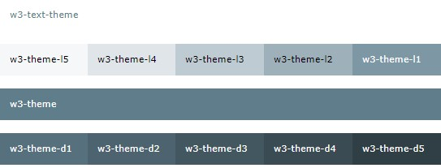
</p>
<!--  {width="5.65625in" height="2.15625in"} -->

<h6 align="center"><i>Figure 13: Sample blue-gray theme</i></h6>

You can use the theme color names and change the website color by simply
specifying a different CSS theme style sheet. Note that many of the
theme colors will not have sufficient contrast to meet accessibility
guidelines. Be aware of the people using your site to ensure that a
theme doesn't make the site more difficult for some users.

<h4 id="ch3-3-1">3.3.1 Available themes</h4>

Table 5 lists the predefined themes available from W3.CSS.

<h6 align="center"><i>Table 5: W3.CSS themes</i></h6>

<div align="center">

| Theme name         | Download name            | Color             |
| ------------------ | ------------------------ | ----------------- |
| <b>Amber</b>       | w3-theme-amber.css       | <b>Text color</b> |
| <b>Black</b>       | w3-theme-black.css       | <b>Text color</b> |
| <b>Blue</b>        | w3-theme-blue.css        | <b>Text color</b> |
| <b>Blue-grey</b>   | w3-theme-blue-grey.css   | <b>Text color</b> |
| <b>Brown</b>       | w3-theme-brown.css       | <b>Text color</b> |
| <b>Cyan</b>        | w3-theme-cyan.css        | <b>Text color</b> |
| <b>Dark Grey</b>   | w3-theme-dark-grey.css   | <b>Text color</b> |
| <b>Deep Orange</b> | w3-theme-deep-orange.css | <b>Text color</b> |
| <b>Deep Purple</b> | w3-theme-deep-purple.css | <b>Text color</b> |
| <b>Green</b>       | w3-theme-green.css       | <b>Text color</b> |
| <b>Grey</b>        | w3-theme-grey.css        | <b>Text color</b> |
| <b>Indigo</b>      | w3-theme-indigo.css      | <b>Text color</b> |
| <b>Khaki</b>       | w3-theme-khaki.css       | <b>Text color</b> |
| <b>Light Blue</b>  | w3-theme-light-blue.css  | <b>Text color</b> |
| <b>Light Green</b> | w3-theme-light-green.css | <b>Text color</b> |
| <b>Lime</b>        | w3-theme-lime.css        | <b>Text color</b> |
| <b>Orange</b>      | w3-theme-orange.css      | <b>Text color</b> |
| <b>Pink</b>        | w3-theme-pink.css        | <b>Text color</b> |
| <b>Purple</b>      | w3-theme-purple.css      | <b>Text color</b> |
| <b>Red</b>         | w3-theme-red.css         | <b>Text color</b> |
| <b>Teal</b>        | w3-theme-teal.css        | <b>Text color</b> |
| <b>Yellow</b>      | w3-theme-yellow.css      | <b>Text color</b> |

</div>

<h2 id="ch4">Chapter 4 Helper Classes</h2>

There are a few classes included that can be attached to various
elements to perform some basic formatting of the element's appearance.

<h3 id="ch4-1">4.1 CSS round</h3>

By default, HTML elements appear as a square box. However, CSS allows
you to set the <b>border- radius</b> property to create boxes with rounded
corners. The W3.CSS framework provides several classes to easily create
rounded corners.
<!--~~~~~~~~~~~~~~~~~~~~~~~~~~~~~~~~~~~~~~~~~~~~~~~~~~~~~~~~~~~~~~~~~~~~~~~~~~~~~~~~~~~~~~~~~~~~-->
<!--~~~~~~~~~~~~~~~~~~~~~ 20. blue simple box & red rounded corners (xx) ~~~~~~~~~~~~~~~~~~~~~~~-->
<p align="center">
  
</p>
<!--  {width="5.25in" height="0.6979166666666666in"} -->

<h6 align="center"><i>Figure 14: Square (rectangle) box and rounded box</i></h6>

Table 6 lists the rounding classes. The larger the pixel size of the
border radius, the more pronounced the rounded corners will be.

<h6 align="center"><i>Table 6: Rounding classes</i></h6>

<div align="center">

| Class name              | Border radius size       |
| ----------------------- | ------------------------ |
| <b>w3-round</b>         | 4 pixels                 |
| <b>w3-round-small</b>   | 2 pixels                 |
| <b>w3-round-medium</b>  | 4 pixels (same as round) |
| <b>w3-round-large</b>   | 8 pixels                 |
| <b>w3-round-xlarge</b>  | 16 pixels                |
| <b>w3-round-xxlarge</b> | 32 pixels                |

</div>

<h4 id="ch4-1-1">4.1.1 Circle class</h4>

In addition to the rounded corners, the framework includes a
<b>w3-circle</b> class to put the entire element in a circle (or oval),
depending on the element size. You can nest circles within each other by
adjusting the elements width using an inline style attribute.

<h3 id="ch4-2">4.2 CSS padding</h3>

The padding classes can be used to add a padding around the cell
content. There are two types of padding classes. The <b>numeric</b> padding
classes add top and bottom padding as specified by the class name. The
<b>size</b> padding classes provide complete padding (all four sides) using
size abbreviations.

<h4 id="ch4-2-1">4.2.1 Numeric padding</h4>

The numeric padding classes are:

- <b>w3-padding-16</b>: Adds 16 pixels top and bottom padding.
- <b>w3-padding-24</b>: Adds 24 pixels top and bottom padding.
- <b>w3-padding-32</b>: Adds 32 pixels top and bottom padding.
- <b>w3-padding-48</b>: Adds 48 pixels top and bottom padding. 
- <b>w3-padding-64</b>: Adds 64 pixels top and bottom padding.

<h4 id="ch4-2-2">4.2.2 Size padding</h4>

The size padding classes add padding to all four sides: top, bottom,
left, and right. The classes are:

-   <b>w3-padding</b>: Adds 8 pixels top and bottom, and 16 pixels left and right (default).
-   <b>w3-padding-small</b>: Adds 4 pixels top and bottom, and 8 pixels left and right.
-   <b>w3-padding-large</b>: Adds 12 pixels top and bottom padding, 24 pixels left and right.

<h3 id="ch4-3">4.3 CSS margins</h3>

The margin classes allow you to add a 16-pixel margin to an element. The
class allows margins to be added to all sides or to individual sides:

-   <b>w3-margin</b>: Adds a 16-pixel margin to all sides.
-   <b>w3-margin-top</b>: Adds a 16-pixel margin to top.
-   <b>w3-margin-right</b>: Adds a 16-pixel margin to right side.
-   <b>w3-margin-bottom</b>: Adds a 16-pixel margin to bottom.
-   <b>w3-margin-left</b>: Adds a 16-pixel margin to left side.
-   <b>w3-section</b>: Adds a 16-pixel margin to top and bottom.

You can combine classes if you only need margins on some edges. The
<b>w3-section</b> class is a shorthand class, the same as adding classes
<b>w3-margin-top</b> and <b>w3-margin-bottom</b> to the element.

<h3 id="ch4-4">4.4 CSS borders</h3>

The W3.CSS framework provides classes to place borders around elements.
The are several border classes available.

<h4 id="ch4-4-1">4.4.1 Basic borders</h4>

The basic border classes allow you to add a border around the entire
element or one or more sides. The classes are:

-   <b>w3-border</b>: Adds borders to all sides (top, bottom, left, right) of the element.

-   <b>w3-border-top</b>: Adds the border to the top of the element.

-   <b>w3-border-right</b>: Adds the border to the right of the element.

-   <b>w3-border-bottom</b>: Adds the border to the bottom of the element.

-   <b>w3-border-left</b>: Adds the border to the left of the element.

-   <b>w3-border-0</b>: Removes all borders from the element.

<h4 id="ch4-4-2">4.4.2 Border colors</h4>

You can add the <b>w3-border-color</b> classes to the border class (both
classes are required) to change the border color. There are two class
types for border colors:

-   <b>w3-border-color</b>: Sets border to specified color (default is black).

-   <b>w3-hover-border-color</b>: Sets border color to use when hovering over the element.

<h4 id="ch4-4-3">4.4.3 Thick borders</h4>

Thicker borders (6 pixels) can provide a nice visual touch to an
element, as shown in Figure 15.
<!--~~~~~~~~~~~~~~~~~~~~~~~~~~~~~~~~~~~~~~~~~~~~~~~~~~~~~~~~~~~~~~~~~~~~~~~~~~~~~~~~~~~~~~~~~~~~-->
<!--~~~~~~~~~~~~~~~~~~~~~~~~~~~~~~ 21. thick border example (xx) ~~~~~~~~~~~~~~~~~~~~~~~~~~~~~~~-->
<p align="center">
  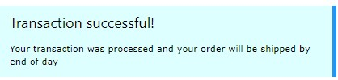
</p>
<!--  {width="4.354166666666667in" height="1.0416666666666667in"} -->

<h6 align="center"><i>Figure 15: Thick border example</i></h6>

The following CSS classes (which can be combined with border colors) can
be used to create thick borders around an element:

-   <b>w3-bottombar</b>: Adds a thick border to the bottom of the element.

-   <b>w3-leftbar</b>: Adds a thick border to the left side of the element.

-   <b>w3-rightbar</b>: Adds a thick border to the right side of the element.

-   <b>w3-topbar</b>: Adds a thick border to the top of the element.

<h3 id="ch4-5">4.5 CSS sizing</h3>

The W3.CSS framework provides a number of classes to change the size of
elements:

-   w3-tiny: Very small font, would make lawyers happy (10 pixels).
-   w3-small: Smaller font (12 pixels).
-   w3-medium: Default font of 15 pixels.
-   w3-large: Font size of 18 pixels.
-   w3-xlarge: Font size of 24 pixels.
-   w3-xxlarge : Font size of 36 pixels.
-   w3-xxxlarge: Font size of 48 pixels.
-   w3-jumbo: Font size of 64 pixels.

These classes can be applied to any element, such as text, buttons,
badges, and tables.

<h3 id="ch4-6">4.6 Summary</h3>

The helper classes and color classes, combined with the other base
classes, provide a tremendous amount of control over your webpage
elements.

<h2 id="ch5">Chapter 5 Containers</h2>

The W3.CSS framework provides a variety of container styles to use in
your application. Working with these containers will require some
JavaScript; however, it is minimal and simple scripting.

<h3 id="ch5-1">5.1 CSS accordions</h3>

An accordion is used when you have several text box elements, typically
a header bar and some content, but don't want all the content exposed at
once. The user will click on the header bar, and the text within that
section will be shown (or hidden).
<!--~~~~~~~~~~~~~~~~~~~~~~~~~~~~~~~~~~~~~~~~~~~~~~~~~~~~~~~~~~~~~~~~~~~~~~~~~~~~~~~~~~~~~~~~~~~~-->
<!--~~~~~~~~~~~~~~~~~~~~~~~~~~~~~ 22. css accordian example (xx) ~~~~~~~~~~~~~~~~~~~~~~~~~~~~~~~-->
<p align="center">
  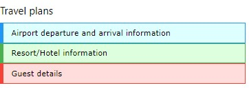
</p>
<!--  {width="3.298611111111111in" height="1.1284722222222223in"} -->

<h6 align="center"><i>Figure 16: CSS accordion example</i></h6>

<h4 id="ch5-1-1">5.1.1 Accordion bars</h4>

The accordion bars are styled buttons, as shown in the following
snippet.

<h6 align="center"><i>Code Listing 10</i></h6>

```
<button onclick="openPanel('Airport');"
  class="w3-btn w3-block w3-pale-blue w3-border-blue
  w3-border w3-leftbar w3-left-align"> Airport departure and arrival
  information </button>
```

The <b>openPanel()</b> JavaScript function will handle the opening and
closing of the accordion content.

<h4 id="ch5-1-2">5.1.2 Building the sections</h4>

To create the section for the accordion, you will need to create a
separate <b>&lt;div&gt;</b> for each section. The following code snippet shows
a sample content <b>&lt;div&gt;</b>.

<h6 align="center"><i>Code Listing 11</i></h6>

```
<div id="Airport" class="w3-container w3-hide">
  <p>Airports</p>
</div>
```
Each <b>&lt;div&gt;</b> will have the <b>w3-hide</b> class applied so that the
content is not visible. The JavaScript code will take care of displaying
the content.

<h4 id="ch5-1-3">5.1.3 Navigation</h4>

To navigate between the accordions, you will need to employ some simple
JavaScript. The code will have two tasks: one is to hide all of the
inactive tabs (based on the class name), and the second is to make the
selected tab visible.

<h6 align="center"><i>Code Listing 12</i></h6>

```
function openPanel(id) {
  var x = document.getElementById(id); 
    if (x.className.indexOf('w3-show') == -1) {
      x.className += ' w3-show'
    } else {
      x.className = x.className.replace(' w3-show','');
    }
}
```
When the user clicks on the accordion button, the <b>openPanel()</b>
function checks to see if the <b>w3-show</b> class is on the current item.
If it is not present, it is added and the content becomes visible. If
the <b>w3-show</b> class is already there, it is removed (which causes the
original <b>w3-hide</b> class to take effect).

<h3 id="ch5-2">5.2 CSS tabs</h3>

Tabs function in a similar manner to accordions, where only one section
of content is visible at a time. However, the navigation among sections
is done via a series of buttons (tabs), typically across the top of the
page.
<!--~~~~~~~~~~~~~~~~~~~~~~~~~~~~~~~~~~~~~~~~~~~~~~~~~~~~~~~~~~~~~~~~~~~~~~~~~~~~~~~~~~~~~~~~~~~~-->
<!--~~~~~~~~~~~~~~~~~~~~~~~~~~~~~~~~ 23. css tabs example (xx) ~~~~~~~~~~~~~~~~~~~~~~~~~~~~~~~~~-->
<p align="center">
  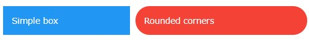
</p>
<!--  {width="5.229166666666667in" height="0.9895833333333334in"} -->

<h6 align="center"><i>Figure 17: CSS tabs example</i></h6>

<h4 id="ch5-2-1">5.2.1 Tab classes</h4>

There are two classes you need to work with in tabs:

-   <b>w3-bar</b>: The container to hold the tab bar across the top.

-   <b>w3-bar-item</b>: The button representing the tab.

<h4 id="ch5-2-2">5.2.2 Building the tabs</h4>

<h6 align="center"><i>Code Listing 13</i></h6>

```
<div class="w3-bar w3-pale-blue w3-leftbar w3-border-blue w3-border">
  <button onclick="openDiv('Airport');"
    class="w3-bar-item w3-button">Airport
  </button>
  <button onclick="openDiv('Hotel');"
    class="w3-bar-item w3-button">Hotel
  </button>
  <button onclick="openDiv('Rental');"
    class="w3-bar-item w3-button">Rental
  </button>
</div>
```

<h4 id="ch5-2-3">5.2.3 Building the sections</h4>

To create sections for the tabs, you will need to create a separate
<b>&lt;div&gt;</b> for each section within the tabs. The following code snippet
shows a sample group of <b>&lt;div&gt;</b> elements. You will need to define a
class name for each of the tab sections---we used <b>travel</b> in our
example code. The first <b>&lt;div&gt;</b> should be displayed, while the
remaining <b>&lt;div&gt;</b> elements are hidden.

<h6 align="center"><i>Code Listing 14</i></h6>

```
<div id="Airport class="travel">
  <p>Airport details</p>
</div>
<div id="Hotel class="travel" style="display:none;">
  <p>Hotel details</p>
</div>
<div id="Rental class="travel" style="display:none;">
  <p>Rental details</p>
</div>
```

<h4 id="ch5-2-4">5.2.4 Navigation</h4>

To navigate between the tabs, you will need to employ some simple
JavaScript. The code will have two purposes: the first is to hide all of
the inactive tabs (based on the class name), and the second is to make
the selected tab visible.

<h6 align="center"><i>Code Listing 15</i></h6>

```
function openDiv(divName) {
  var x = document.getElementsByClassName('travel'); 
    for (var i =0; i < x.length; i++) { 
      x[i].style.display = 'none';
    }
  document.getElementById(divName).style.display = 'block';
}
```

When the user clicks on the tab, the JavaScript function is called and
passed the <b>divName</b> to open.

<h4 id="ch5-2-5">5.2.5 Vertical tabs</h4>

Although tabs are typically horizontal, you can easily create vertical
tabs with a few small changes to the layout.
<!--~~~~~~~~~~~~~~~~~~~~~~~~~~~~~~~~~~~~~~~~~~~~~~~~~~~~~~~~~~~~~~~~~~~~~~~~~~~~~~~~~~~~~~~~~~~~-->
<!--~~~~~~~~~~~~~~~~~~~~~~~~~~~~~ 24. vertical tabs example (xx) ~~~~~~~~~~~~~~~~~~~~~~~~~~~~~~~-->
<p align="center">
  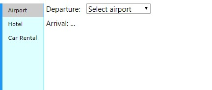
</p>
<!--  {width="4.5in" height="1.90625in"} -->

<h6 align="center"><i>Figure 18: Vertical tabs example</i></h6>

You need to change the <b>w3-bar</b> class to <b>w3-bar-block</b> and add the
<b>w3-sidebar</b> class. In addition, you'll need to set the width of the
tab menu.

<h6 align="center"><i>Code Listing 16</i></h6>

```
<div class="w3-sidebar w3-bar-block w3-pale-blue
  w3-border-blue w3-border" style="width:120px;">
```

You will also need to add <b>margin-left</b> style to the sections, as
follows.

<h6 align="center"><i>Code Listing 17</i></h6>

```
<div id="Airport" class="travel" style="margin-left:125px;">
```

Be sure to set the margin large enough to start past the width of the
menu. You should add the <b>margin-left</b> style in the travel class,
rather than inline.

<h3 id="ch5-3">5.3 CSS cards</h3>

A card is a container with a shadow around it to provide a paper-like
appearance to an element. The framework provides a simple <b>w3-card</b>
class to create a card element. The <b>w3-card-4</b> is similar, except
that the shadow around the card is larger (4 pixels rather than 2
pixels). By default, the card will be white, although you can add any
<b>w3-color</b> class to create a colored card.

For example, the following code snippet would display the card shown in
Figure 19 on a webpage.

<h6 align="center"><i>Code Listing 18</i></h6>

```
<div class="w3-card-4 w3-cyan w3-padding w3-margin">
  <p class="w3-text-white w3-large">Danielle Salsbury</p>
  <p>Tennis player extraordinaire</p>
</div>
```

<!--~~~~~~~~~~~~~~~~~~~~~~~~~~~~~~~~~~~~~~~~~~~~~~~~~~~~~~~~~~~~~~~~~~~~~~~~~~~~~~~~~~~~~~~~~~~~-->
<!--~~~~~~~~~~~~~~~~~~~~~~~~~~~~~~~~ 25. css card sample (xx) ~~~~~~~~~~~~~~~~~~~~~~~~~~~~~~~~~~-->
<p align="center">
  
</p>
<!--  {width="3.6354166666666665in" height="0.9375in"} -->

<h6 align="center"><i>Figure 19: CSS card sample</i></h6>

<h3 id="ch5-4">5.4 CSS sidebar</h3>

A common website container is the sidebar menu, where the navigation
options appear on the

side of the screen, and the content appears in a larger area off to the
other side. It is constructed very similarly to vertical tabs, but has
additional options available to increase its flexibility.
<!--~~~~~~~~~~~~~~~~~~~~~~~~~~~~~~~~~~~~~~~~~~~~~~~~~~~~~~~~~~~~~~~~~~~~~~~~~~~~~~~~~~~~~~~~~~~~-->
<!--~~~~~~~~~~~~~~~~~~~~~~~~~~~~~ 26. basic sidebar, example (xx) ~~~~~~~~~~~~~~~~~~~~~~~~~~~~~~-->
<p align="center">
  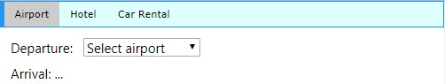
</p>
<!--  {width="3.8125in" height="1.4791666666666667in"} -->

<h6 align="center"><i>Figure 20: Basic sidebar</i></h6>

<h4 id="ch5-4-1">5.4.1 Basic sidebar</h4>

To create the sidebar, you need to use the <b>w3-sidebar</b> and
<b>w3-bar-block</b> classes, as well as set the width of the sidebar.
Background colors and borders are optional, but generally the sidebar
should be distinguished from the rest of the screen. The following code
snippet shows the basic sidebar setup.

<h6 align="center"><i>Code Listing 19</i></h6>

```
<div class="w3-sidebar w3-bar-block w3-border">
  <a href="#" class="w3-bar-item w3-button">Airport</a>
  <a href="#" class="w3-bar-item w3-button">Hotel</a>
  ...
</div>
```

You will also need to set the left margin of the content elements large
enough to be positioned past the right border of the sidebar.

<h4 id="ch5-4-2">5.4.2 Collapsible sidebar</h4>

A fairly common technique on websites, particularly mobile sites, is
hiding the sidebar menu (providing more space for the main content), and
only opening the menu when the user clicks an icon (typically the
"hamburger" icon with three horizontal bars). With a little JavaScript,
you can have the W3.CSS sidebar provide this behavior.

#### Creating the icon 

You will need to add a header (or some container to show the menu icon).
Be sure to provide an <b>id</b> for the menu icon (<b>openNav</b> in our
example). The <b>#9776</b> is the HTML entity code for the hamburger menu
icon. The following code snippet shows the header and icon example code.

<h6 align="center"><i>Code Listing 20</i></h6>

```
<div class="w3-container w3-pale-green">
  <h4>
    <span id="openNav" class="w3-small w3-button"
      onclick="openMenu();">&#9776;
    </span>
    My travel plans</a>
  </h4>
</div>
```

When the user clicks on the icon, the <b>openMenu()</b> JavaScript function
is called.

#### Creating the sidebar 

The sidebar itself is created using the same code as the basic sidebar
code, with a couple changes. First, the sidebar menu will need an
<b>id</b>, since the JavaScript code will need to reference it. In
addition, it initially will not be visible on the screen.

The other change is a new menu item, to call the JavaScript
<b>closeMenu()</b> function to hide the sidebar when clicked.

<h6 align="center"><i>Code Listing 21</i></h6>

```
<div class="w3-sidebar w3-bar-block w3-border" id="sideBAR"
  style="width:20%;display:none;">
  <button class="w3-bar-item w3-button"
    onclick="closeMenu();">&times;
  </button>
  <a href="#" class="w3-bar-item w3-button">Airport</a> 
  <a href="#" class="w3-bar-item w3-button">Hotel</a>
  ...
</div>
```

#### Opening and closing 

The JavaScript functions to open and close the menu simply need to
toggle the menu's display style, to show or hide the menu. The following
code snippet shows the necessary JavaScript.

<h6 align="center"><i>Code Listing 22</i></h6>

```
function openMenu() {
  document.getElementsById('sideBAR').style.display = 'block';
}
function closeMenu() {
  document.getElementsById('sideBAR').style.display = 'none';
}
```

Keep in mind that the element name for the sidebar is case sensitive, so
be sure the <b>id</b> name matches the <b>id</b> you've assigned to your
sidebar menu.

<h4 id="ch5-4-3">5.4.3 Slide content to right</h4>

While the collapsible sidebar appears properly, there might be times
when you want the content to shift to the right, rather than be
overwritten by the sidebar menu. Fortunately, this is an easy change to
the JavaScript function needed for the collapsible sidebar menu. The
following JavaScript code will open the menu and adjust the screen
content.

<h6 align="center"><i>Code Listing 23</i></h6>

```
function openandMoveMenu() {
  document.getElementsById('main').style.marginLeft = '21%';
  document.getElementsById('sideBAR').style.width = '20%';
  document.getElementsById('sideBAR').style.display = 'block';
  document.getElementsById('openNav').style.display = 'none';
}
function closeMenu() {
  document.getElementsById('main').style.marginLeft = '1%';
  document.getElementsById('sideBAR').style.display = 'none';
  document.getElementsById('openNav').style.display = 'inline-block';
}
```

You will need to adjust the margin and width percentages to match your
sidebar menu width, and adjust the left margin of the content of the
main portion of your screen.

<h3 id="ch5-5">5.5 CSS panels</h3>

The <b>w3-panel</b> class is very similar to the <b>w3-container</b> class,
but includes a 16-pixel top and bottom margin to have the panel stand
out a bit from the background. This makes the panel a good choice for
things like notes and alerts.

The following code snippet illustrates a panel to display a warning
message.

<h6 align="center"><i>Code Listing 24</i></h6>

```
<div class="w3-panel w3-red w3-round-xxlarge w3-margin">
  <h3 class="w3-text-yellow"><b>Warning</b></h3>
  <p>This action will delete hundreds of records and will be recorded in
    the audit trail</p>
</div>
```

<!--~~~~~~~~~~~~~~~~~~~~~~~~~~~~~~~~~~~~~~~~~~~~~~~~~~~~~~~~~~~~~~~~~~~~~~~~~~~~~~~~~~~~~~~~~~~~-->
<!--~~~~~~~~~~~~~~~~~~~~~~~~~~~~~ 27. warning panel, example (xx) ~~~~~~~~~~~~~~~~~~~~~~~~~~~~~~-->
<p align="center">
  
</p>
<!--  {width="3.0833333333333335in" height="1.0in"} -->

<h6 align="center"><i>Figure 21: Warning panel</i></h6>

<h3 id="ch5-6">5.6 Summary</h3>

The W3.CSS framework provides a number of ways to present content and
actions, and with minor JavaScript, you can have an easy-to-work system
to provide the user with navigation between menus and content on your
site.

<h2 id="ch6">Chapter 6 Visual Elements</h2>

W3.CSS includes a few classes for creating visual elements on the page.
All these elements use the <b>w3-panel</b> as their base class.

<h3 id="ch6-1">6.1 CSS notes</h3>

Notes are boxes of information displayed on the website, and can be
easily constructed using the <b>w3-panel</b> base and some helper classes.
For example, the following code snippet would produce a bordered note
container.

<h6 align="center"><i>Code Listing 25</i></h6>

```
<div class="w3-container">
  <div class="w3-panel w3-border w3-pale-red w3-round-large">
    <p>All credit card payments MUST be verified prior to shipping!</p>
  </div>
</div>
```

<!--~~~~~~~~~~~~~~~~~~~~~~~~~~~~~~~~~~~~~~~~~~~~~~~~~~~~~~~~~~~~~~~~~~~~~~~~~~~~~~~~~~~~~~~~~~~~-->
<!--~~~~~~~~~~~~~~~~~~~~~~~~~~~~~~~~ 28. css note example (xx) ~~~~~~~~~~~~~~~~~~~~~~~~~~~~~~~~~-->
<p align="center">
  
</p>
<!--  {width="2.8958333333333335in" height="0.7291666666666666in"} -->

<h6 align="center"><i>Figure 22: CSS note example</i></h6>

<h4 id="ch6-1-1">6.1.1 Customizing the notes</h4>

In addition to colors and rounded corners, you can use the following
classes to improve the appearance of notes:

-   <b>w3-border-color</b>: Defines the color for border elements.

-   <b>w3-leftbar</b>: Adds a vertical bar on left side of the container.

-   <b>w3-rightbar</b>: Adds a vertical bar on right side of the container.

-   <b>w3-topbar</b>: Adds a horizontal bar on the top of the container.

-   <b>w3-bottombar</b>: Adds a horizontal bar on the container bottom.

Figure 23 shows the previous note with a <b>w3-border-red</b> and
<b>w3-leftbar</b> class added.

<!--~~~~~~~~~~~~~~~~~~~~~~~~~~~~~~~~~~~~~~~~~~~~~~~~~~~~~~~~~~~~~~~~~~~~~~~~~~~~~~~~~~~~~~~~~~~~-->
<!--~~~~~~~~~~~~~~~~~~~~~~~~~~~ 29. css custom note appearange (xx) ~~~~~~~~~~~~~~~~~~~~~~~~~~~~-->
<p align="center">
  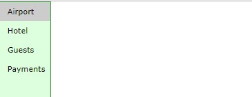
</p>
<!--  {width="2.78125in" height="0.625in"} -->

<h6 align="center"><i>Figure 23: CSS custom note appearance</i></h6>

<h3 id="ch6-2">6.2 CSS alerts</h3>

Alerts are generally messages on the website that need attention from
the user. Typically, the color of the alert suggests the severity of the
issue. A red alert indicates a risky or negative situation, while green
is generally positive, a confirmation that something worked.

The general structure of an alert is as follows.

<h6 align="center"><i>Code Listing 26</i></h6>

```
<div class="w3-display-container w3-panel w3-pale-yellow w3-margin">
  <span onclick="this.parentElement.style.display='none'"
    class="w3-button w3-pale-yellow w3-large
      w3-display-topright">&times;</span>
  <h3>Confirm</h3>
  <p>Please confirm address prior to shipping!</p>
</div>
```

In this example, we are using the <b>w3-display-container</b> class to
place an X in the upper corner. Clicking the X will dismiss the alert.
We are using the <b>&times</b> HTML entity rather than the letter X for the
closing button.

The <b>onclick</b> code simply changes the alert's display style property
to <b>none</b>, causing the alert to disappear from the screen.

<!--~~~~~~~~~~~~~~~~~~~~~~~~~~~~~~~~~~~~~~~~~~~~~~~~~~~~~~~~~~~~~~~~~~~~~~~~~~~~~~~~~~~~~~~~~~~~-->
<!--~~~~~~~~~~~~~~~~~~~~~~~~~~~~~~~ 30. sample alert panel (xx) ~~~~~~~~~~~~~~~~~~~~~~~~~~~~~~~~-->
<p align="center">
  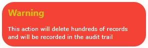
</p>
<!--  {width="3.3645833333333335in" height="0.7708333333333334in"} -->

<h6 align="center"><i>Figure 24: Sample alert panel</i></h6>

Generally, the following colors could be used for alert messages:

-   Red or pale red: Error condition, needs attention.

-   Yellow or pale yellow: Warning, might need attention.

-   Green, pale green : Success!

-   Blue, cyan: Information only.

<!--~~~~~~~~~~~~~~~~~~~~~~~~~~~~~~~~~~~~~~~~~~~~~~~~~~~~~~~~~~~~~~~~~~~~~~~~~~~~~~~~~~~~~~~~~~~~-->
<!--~~~~~~~~~~~~~~~~~~~~~~~~~~~~~~~~~~ 08. notepad logo (xx) ~~~~~~~~~~~~~~~~~~~~~~~~~~~~~~~~~~~-->
<p align="left">
  
<!--  {width="0.25in" height="0.28958333333333336in"} -->
> <i><b>Note: Colors are not universal, and
> have different meanings in different cultures.</b></i>
>
> <i><b>For example, the color red in western cultures generally means
> danger, while in China, the color red represents luck. Be sure to
> consider your audience when choosing colors for alerts and boxes.</b></i>

<h2 id="ch7">Chapter 7 Text</h2>

The default font family in the W3.CSS framework is <b>Verdana,
sans-serif</b>, with a font size of 15 pixels. It also has a default line
spacing of 1.5, which produces webpages that are easy to read for most
users. The font is set on the HTML and body tags, which means it will be
used for all elements on the site, unless specifically changed.

The H1 through H6 header sizes use the font family of <b>Segoe UI</b>,
<b>Arial</b>, <b>sans-serif</b>.
<!--~~~~~~~~~~~~~~~~~~~~~~~~~~~~~~~~~~~~~~~~~~~~~~~~~~~~~~~~~~~~~~~~~~~~~~~~~~~~~~~~~~~~~~~~~~~~-->
<!--~~~~~~~~~~~~~~~~~~~~~~~~~~~~~~~~~~ 08. notepad logo (xx) ~~~~~~~~~~~~~~~~~~~~~~~~~~~~~~~~~~~-->
<p align="left">
  
<!--  {width="0.25in" height="0.28958333333333336in"} -->
> <i><b>Note: A serif font (such as Times
> Roman or Georgia) has little decorative strokes on the end of the
> letters, while a sans serif font (such as Helvetica or Arial) does not
> have these strokes. The font family tells the browser to try each font
> in the list, and if not found, just choose any font that most closely
> matches the last item in the family. W3.CSS suggests Verdana, and if
> not found, asks the browser to use a sans-serif font.</b></i>
</p>

<h3 id="ch7-1">7.1 CSS fonts</h3>

You could easily override the Verdana font by adding a font family to
your HTML and body elements after the W3.CSS file is loaded, for
example.

<h6 align="center"><i>Code Listing 27</i></h6>

```
<link rel="stylesheet" href="css/w3.css">
<link rel="stylesheet" href="clientStyle.css">
```

Where the file <b>clientStyle.css</b> contains a line similar to the following.

<h6 align="center"><i>Code Listing 28</i></h6>

```
html, body {
  font-family: "Georgia", sans-serif;
}
```

You could modify the W3.CSS file as well, but I would advise you to put
your unique settings into a separate style sheet, rather than risk
losing them if you download a W3.CSS update.

<h4 id="ch7-1-1">7.1.1 Print style</h4>

Verdana is a good, flexible font, but you might want to choose a
different font for printing. The following code snippet shows a media
query to change the printed font to an alternative font.

<h6 align="center"><i>Code Listing 29</i></h6>

```
@media print { 
  html, body {
    font-family: Helvetica, sans-serif;
  }
  h1, h2, h3, h4, h5, h6 {
    font-family: "Century Gothic", Helvetica, sans-serif;
  }
}
```

<h3 id="ch7-2">7.2 Web fonts</h3>

When a browser chooses a font, it relies on the fonts that are installed
on the user's computer. However, CSS allows you to use fonts that are
available at a web location, rather than the user's computer. These are
referred to as <i>web fonts</i>.

A popular source of web fonts is the <a href="https://fonts.google.com/">Google Fonts 
library</a>. This site contains hundreds of web fonts you can use to improve your 
website's appearance.

<h4 id="ch7-2-1">7.2.1 Installing the font</h4>

To use a web font, you will need to install it into your webpage. For
example, the Tangerine

Google font could be added via the following code placed in the <b>&lt;head&gt;</b> 
section of the website.

<h6 align="center"><i>Code Listing 30</i></h6>

```
<link rel="stylesheet"
href="https://fonts.googleapis.com/css?family=Tangerine">
```

This will add a new font called <b>Tangerine</b> to your site. Tangerine is
a script font, so you could create a class to use when displaying
signatures.

<h6 align="center"><i>Code Listing 31</i></h6>

```
.SignatureLine {
  font-family: Tangerine, script, serif;
}
```

Be sure to include a default font in case the requested font is not
loaded for any reason. Also, keep in mind that the font file needs to be
loaded when the page starts, which can slow down the startup time.

<h3 id="ch7-3">7.3 Alignment</h3>

There are three classes you can use to align text (and other elements)
horizontally within a container. These classes are:

-   <b>w3-left-align</b>: Aligns text to the left.

-   <b>w3-right-align</b>: Aligns text to the right.

-   <b>w3-center</b>: Centers text within the container.

<h3 id="ch7-4">7.4 Text features</h3>

You can change the appearance of your text a bit by using a couple of
additional classes with the framework. These classes allow you to widen
the text or set the opacity. For example, the following code snippet
adds 4 pixels of spacing between the characters in the text.

```
<p class="w3-wide">On sale today only!</p> 
```

The <b>w3-opacity</b> class sets the opacity of the element to 60 percent.
The opacity value determines how translucent the text is. The smaller
the number, the more translucent the element appears. The following
figure shows how you can use the opacity class to display an error
message, but still let the user see the screen beneath the error
message.

<!--~~~~~~~~~~~~~~~~~~~~~~~~~~~~~~~~~~~~~~~~~~~~~~~~~~~~~~~~~~~~~~~~~~~~~~~~~~~~~~~~~~~~~~~~~~~~-->
<!--~~~~~~~~~~~~~~~~~~~~~~~~~~~~~~~~ 31. opacity example (xx) ~~~~~~~~~~~~~~~~~~~~~~~~~~~~~~~~~~-->
<p align="center">
  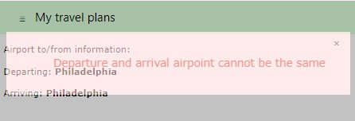
</p>
<!--  {width="4.645833333333333in" height="1.5833333333333333in"} -->

<h6 align="center"><i>Figure 25: Opacity example</i></h6>

You can also use the <b>w3-opacity-max</b> class to set the opacity to 25
percent, and the <b>w3opacity-min</b> class to set the level to 75 percent.
The <b>w3-opacity-off</b> class will set the opacity to 100 percent (i.e.
totally opaque).
<!--~~~~~~~~~~~~~~~~~~~~~~~~~~~~~~~~~~~~~~~~~~~~~~~~~~~~~~~~~~~~~~~~~~~~~~~~~~~~~~~~~~~~~~~~~~~~-->
<!--~~~~~~~~~~~~~~~~~~~~~~~~~~~~~~~~~~ 31. orange logo (xx) ~~~~~~~~~~~~~~~~~~~~~~~~~~~~~~~~~~~~-->
<p align="center">
  
<!-- [](./images/image032.png) {width="0.14333333333333334in" height="0.25in"} -->
<i><b>Tip: Opacity can be used when you are loading
content via Ajax. Set the class to</b> w3-opacity-max <b>during the</b>
before Send <b>event, and set the class to</b> w3-opacity-off <b>during
the</b> complete <b>event. This will provide a visual indication to the
user that a portion of the screen has been updated.</b></i>
</p>

<h3 id="ch7-5">7.5 CSS code</h3>

If you want to display some sort of code, such as programming code or
computer instructions, you can use the <b>w3-code</b> class.

<h6 align="center"><i>Code Listing 32</i></h6>

```
<div class="w3-code" translate="no">
  function DisplayError(msg)<br/>
  {<br/>
  &nbsp;&nbsp;&nbsp;alert(msg);<br/>
  }<br/>
  </div>
```

>  <!-- {width="0.25in" height="0.28958333333333336in"} -->
> <i><b>Note:</b> Translate="no" <b>is an
> HTML5 attribute indicating the following content should not be
> translated to other languages.</b></i>

The default font families for code are Consolas and Courier New.

<h2 id="ch8">Chapter 8 Menus</h2>

> Navigation refers to the hyperlinks and references that allow a user
> to move among pages in a website. The W3.CSS framework provides
> classes to allow you to control the appearance of your menu links.

<h3 id="ch8-1">8.1 CSS navigation</h3>

The basic navigation element is an anchor tag <b>&lt;a&gt;</b>, with an
<b>HREF</b> attribute indicating the content to load when the element is
clicked. You can also use JavaScript and Ajax to load partial content,
by using the <b>onclick</b> event. The syntax is as follows.

<h6 align="center"><i>Code Listing 33</i></h6>

```
<a href="#"
  onclick="CallJavaScript();return false;">
  Menu text
</a>
```

The value of the <b>HREF</b> indicates the link to execute when clicked. If
an <b>onclick</b> event is called, then the <b>HREF</b> will only be used if
the <b>onclick</b> function returns <b>TRUE</b>. Single page applications keep
the menu structure generally intact, and only update the content area by
calling JavaScript to build the content window.

<h4 id="ch8-1-1">8.1.1 Basic structure</h4>

The following code snippet shows the basic menu structure, without any
classes applied yet. <i>Code Listing 34</i>

```
<div>
  <a href="#">Home</a>
  <a href="#">Customers</a>
  <a href="#">Orders</a>
  <a href="#">Shipping</a>
</div>
```

Running this code produces the screen shown in Figure 26, simply a row of hyperlinks.

<!--~~~~~~~~~~~~~~~~~~~~~~~~~~~~~~~~~~~~~~~~~~~~~~~~~~~~~~~~~~~~~~~~~~~~~~~~~~~~~~~~~~~~~~~~~~~~-->
<!--~~~~~~~~~~~~~~~~~~~~~~~~~~~~~~~ 33. menu items, example (xx) ~~~~~~~~~~~~~~~~~~~~~~~~~~~~~~~-->
<p align="center">
  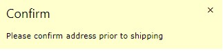
</p>
<!--  {width="2.1770833333333335in" height="0.5729166666666666in"} -->

<h6 align="center"><i>Figure 26: Menu items</i></h6>

<h4 id="ch8-1-2">8.1.2 Horizontal menu</h4>

Adding the <b>w3-bar</b> class, an optional color class to the <b>&lt;div&gt;</b>
tag, and the <b>w3-bar-item</b> and <b>w3-button</b> classes, produces a
horizontal menu with a blue background.

<h6 align="center"><i>Code Listing 35</i></h6>

```
<div class="w3-bar w3-blue">
  <a href="#" class="w3-bar-item w3-button">Home</a>
  <a href="#" class="w3-bar-item w3-button">Customers</a>
  <a href="#" class="w3-bar-item w3-button">Orders</a>
  <a href="#" class="w3-bar-item w3-button">Shipping</a>
</div>
```

The <b>w3-button</b> class displays the hyperlinks as buttons, so they are
not underlined. The result is shown in Figure 27.

<!--~~~~~~~~~~~~~~~~~~~~~~~~~~~~~~~~~~~~~~~~~~~~~~~~~~~~~~~~~~~~~~~~~~~~~~~~~~~~~~~~~~~~~~~~~~~~-->
<!--~~~~~~~~~~~~~~~~~~~~~~~~~~ 34. horizontal menu bar, example (xx) ~~~~~~~~~~~~~~~~~~~~~~~~~~~-->
<p align="center">
  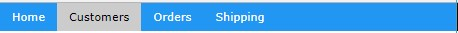
</p>
<!--  {width="4.770833333333333in" height="0.34375in"} -->

<h6 align="center"><i>Figure 27: Horizontal menu</i></h6>

#### Other classes 

You can add some helper classes to adjust the menu's appearance even
more. These classes are:

-   <b>w3-border</b>: Adds a border around the entire bar.

-   <b>w3-card</b>: Displays the bar in a "card," with a shadow.

-   <b>w3-round</b>: Creates a rounded menu effect.

-   <b>w3-mobile</b>: Causes the items to stack vertically on smaller
    screens.

-   <b>w3-size</b>: Increases the font size of the menu items.

For example, the following code snippet would produce the pale green,
rounded menu bar shown in Figure 28.

<h6 align="center"><i>Code Listing 36</i></h6>

```
<div class="w3-bar w3-pale-green w3-border w3-round-xxlarge w3-margin">
```

<!--~~~~~~~~~~~~~~~~~~~~~~~~~~~~~~~~~~~~~~~~~~~~~~~~~~~~~~~~~~~~~~~~~~~~~~~~~~~~~~~~~~~~~~~~~~~~-->
<!--~~~~~~~~~~~~~~~~~~~~~~~~~~~~~~~~ 35. rounded menu bar (xx) ~~~~~~~~~~~~~~~~~~~~~~~~~~~~~~~~~-->
<p align="center">
  
</p>
<!--  {width="4.614583333333333in" height="0.46875in"} -->

<h6 align="center"><i>Figure 28: Rounded menu bar</i></h6>

<h4 id="ch8-1-3">8.1.3 Menu items</h4>

The <b>w3-bar-item</b> class is the basic class to create menu items within
the bar. When you hover over a menu item, the background color will
change to gray to indicate the menu item to be clicked.

#### Changing hover colors 

Adding <b>w3-hover-color</b> class to an item allows you to overwrite the
hover color from gray to another color. You can also add the
<b>w3-hover-none</b> if you don't want the hover effect at all.

<h6 align="center"><i>Code Listing 37</i></h6>

```
<!-- Change hover color to green. -->
<a href="#" class="w3-bar-item w3-button w3-hover-green">Customers</a>
<!-- Remove hover entirely for this item. -->
<a href="#" class="w3-bar-item w3-button w3-hover-none">Home</a>
```

#### Right-align items 

The <b>w3-right</b> class, when added to the bar item, causes the item to
be aligned to the right side of the bar. Often, the help link is moved
to the right, to keep it distinct from the operational links.

#### Adding text and buttons to the menu bar 

Since the bar is the primary navigation for the site, you might need to
add text or input elements to the bar. The following screen illustrates
a navigation bar showing the currently selected club and the ability to
search for a team or player.

<!--~~~~~~~~~~~~~~~~~~~~~~~~~~~~~~~~~~~~~~~~~~~~~~~~~~~~~~~~~~~~~~~~~~~~~~~~~~~~~~~~~~~~~~~~~~~~-->
<!--~~~~~~~~~~~~~~~~~~~~~~~~~ 36. navigation bar/search example (xx) ~~~~~~~~~~~~~~~~~~~~~~~~~~~-->
<p align="center">
  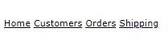
</p>
<!--  {width="6.5in" height="0.5625in"} -->

<h6 align="center"><i>Figure 29: Soccer site navigation</i></h6>

The following code illustrates adding text (YSC Sports club) and a
search box and button to the bar items. You do not need to limit bar
items to just buttons.

<h6 align="center"><i>Code Listing 38</i></h6>

```
<div class="w3-bar w3-pale-green w3-border w3-round-xxlarge w3-margin">

<span class="w3-bar-item w3-text-blue"><b>YSC Sports Club</b> </span>

  <a href="#" class="w3-bar-item w3-button">Teams</a>

  <a href="#" class="w3-bar-item w3-button">Players</a>

  <!-- HTML entity for a calendar icon -->
  <a href="#" class="w3-bar-item w3-button">&#128197;Schedule</a>
  <input type="text" class="w3-bar-item w3-input"
    placeholder="Search for team or player.." >
  <!-- HTML entity for a search icon -->
  <a href="#" class="w3-bar-item w3-button">&#128269;</a>
</div>
```

#### Drop-down menu items 

You can also add a drop-down menu to your navigation using the
<b>w3-dropdown-hover</b> and <b>w3dropdown-content</b> classes. The following
code snippet shows an example of added schedule menu options to our
soccer navigation bar.

<!--~~~~~~~~~~~~~~~~~~~~~~~~~~~~~~~~~~~~~~~~~~~~~~~~~~~~~~~~~~~~~~~~~~~~~~~~~~~~~~~~~~~~~~~~~~~~-->
<!--~~~~~~~~~~~~~~~~~~ 37. drop-down navigation menu with search example (xx) ~~~~~~~~~~~~~~~~~~-->
<p align="center">
  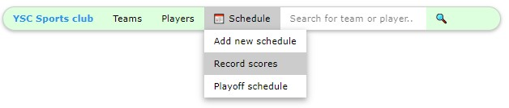
</p>
<!--  {width="6.5in" height="1.4in"} -->

<h6 align="center"><i>Figure 30: Drop-down menus</i></h6>

The following is the code for this example. The menu option is a wrapper
in the <b>w3-dropdownhover</b> class, and the actual drop-down menu is in
the <b>w3-dropdown-content</b> class.

<h6 align="center"><i>Code Listing 39</i></h6>

```
<div class="w3-dropdown-hover">
  <button class="w3-button">&#128197;&nbsp;Schedule</button>
  <div class="w3-dropdown-content w3-bar-block w3-card-4">
    <a href="#" class="w3-bar-item w3-button">Add new schedule</a>
    <a href="#" class="w3-bar-item w3-button">Record scores</a>
    <a href="#" class="w3-bar-item w3-button">Playoff schedule</a>
  </div>
</div>
```

The bar items within the drop-down menu can also have custom colors and
hover colors. They are regular menu bar items, and can even be text and
input text elements.

<h4 id="ch8-1-4">8.1.4 Navigation bar positions</h4>

Often, you want to keep the navigation bar positioned at the top or
bottom of the page. This is accomplished simply by wrapping the entire
menu bar and items with a <b>&lt;div&gt;</b> tag using the <b>w3top</b> or
<b>w3-bottom</b> classes.

<h6 align="center"><i>Code Listing 40</i></h6>

```
<div class="w3-top">
  Menu bar items
</div>
```

#### Vertical navigation bar 

You can flip the navigation bar to a vertical orientation simply by
replacing the <b>w3-bar</b> class with the <b>w3-bar-block</b> class, as
follows.

<h6 align="center"><i>Code Listing 41</i></h6>

```
<div class="w3-bar-block w3-pale-green w3-margin" style="width:27%;">
```

<!--~~~~~~~~~~~~~~~~~~~~~~~~~~~~~~~~~~~~~~~~~~~~~~~~~~~~~~~~~~~~~~~~~~~~~~~~~~~~~~~~~~~~~~~~~~~~-->
<!--~~~~~~~~~~~~~~~~~~~ 38. vertical navigation bar with search example (xx) ~~~~~~~~~~~~~~~~~~~-->
<p align="center">
  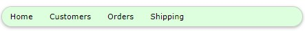
</p>
<!--  {width="1.2388057742782153in" height="1.525in"} -->

<h6 align="center"><i>Figure 31: Vertical bar</i></h6>

Notice that you might need to set the width of the block, since the
default is the entire width of the parent container.

<h3 id="ch8-2">8.2 Summary</h3>

Navigation among pages should be easy and intuitive, and the W3 classes
make it simple to create visually appealing menu structures. Here is a
summary of the classes:

-   w3-bar: Creates the menu bar.

-   w3-bar-block: Creates a vertical menu bar.

-   w3-top: Keeps menu bar at top of page.

-   w3-bottom: Keeps menu bar at bottom of page.

-   w3-bar-item: Adds button, text, or input for item on the menu.

-   w3-dropdown-hover: Creates a drop-down element on the menu.

-   w3-dropdown-content: Menu bar items within the drop-down menu.

<h2 id="ch9">Chapter 9 Tables and Lists</h2>

The HTML table system is primarily designed for displaying tabular data
in rows and columns. Your HTML code must create the basic table
structure, but W3 provides classes to easily enhance the table's
appearance.

<h3 id="ch9-1">9.1 CSS tables</h3>

A basic table consists of the <b>&lt;table&gt;</b> tag, followed by some number
of rows of <b>&lt;tr&gt;</b> elements. Within the <b>&lt;tr&gt;</b>...<b>&lt;/tr&ast;&gt;</b> row
will be any number of <b>&lt;td&gt;</b>...<b>&lt;/td&gt;</b> elements. Each row should
have the same number of elements; if not, blank spaces will appear
within the table structure.

<h6 align="center"><i>Code Listing 42</i></h6>

```
<table>
  <tr>
    <th>Player name</th>
    <th>Team</th>
    <th>Yards</th>
    <th>TD</th>
  </tr>
  <tr>
    <td>Nick Foles</td>
    <td>Philadelphia Eagles</td>
    <td>373</td>
    <td>3</td>
  </tr>
  <tr>
    <td>Tom Brady </td>
    <td>New England Patriots </td>
    <td>505</td>
    <td>3</td>
  </tr>
</table>
```

Each of the available W3 classes is applied to the <b>&lt;table&gt;</b> element.

<h4 id="ch9-1-1">9.1.1 Basic table</h4>

The <b>w3-table</b> class provides the basic table structure, with a width
of 100 percent. You can add this class to any table within a site.

<h6 align="center"><i>Code Listing 43</i></h6>

```
<table class="w3-table">
</table>
```

Figure 32 shows the sample table.

<!--~~~~~~~~~~~~~~~~~~~~~~~~~~~~~~~~~~~~~~~~~~~~~~~~~~~~~~~~~~~~~~~~~~~~~~~~~~~~~~~~~~~~~~~~~~~~-->
<!--~~~~~~~~~~~~~~~~~~~~~~~~~~ 39. w3 table w/4 columns example (xx) ~~~~~~~~~~~~~~~~~~~~~~~~~~~-->
<p align="center">
  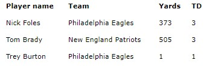
</p>
<!--  {width="3.6in" height="1.1in"} -->

<h6 align="center"><i>Figure 32: Sample table</i></h6>

Additional classes can be added to control the table's appearance.

#### Striped table 

The <b>w3-striped</b> class adds striping, so alternating rows will have a
shaded effect, as shown in Figure 33.

<!--~~~~~~~~~~~~~~~~~~~~~~~~~~~~~~~~~~~~~~~~~~~~~~~~~~~~~~~~~~~~~~~~~~~~~~~~~~~~~~~~~~~~~~~~~~~~-->
<!--~~~~~~~~~~~~~~~~~~~~~~ 40. striped w3 table w/4 columns example (xx) ~~~~~~~~~~~~~~~~~~~~~~~-->
<p align="center">
  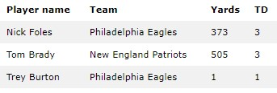
</p>
<!--  {width="3.5729166666666665in" height="1.2083333333333333in"} -->

<h6 align="center"><i>Figure 33: Striped table</i></h6>

The striped rows make the table easier to read.

#### Borders 

There are two classes for adding borders to the table. The <b>w3-border</b>
class adds a border around the entire table. The <b>w3-bordered</b> class
adds a bottom border to each row in the table.

<h4 id="ch9-1-2">9.1.2 w3-table-all</h4>

The <b>w3-table-all</b> class adds all the features (borders and shading)
to the table. Figure 34 shows the class applied to our sample table.

<!--~~~~~~~~~~~~~~~~~~~~~~~~~~~~~~~~~~~~~~~~~~~~~~~~~~~~~~~~~~~~~~~~~~~~~~~~~~~~~~~~~~~~~~~~~~~~-->
<!--~~~~~~~~~~~~~~ 41. striped w3 table w/4 columns border/shading example (xx) ~~~~~~~~~~~~~~~~-->
<p align="center">
  
</p>
<!--  {width="4.730555555555555in" height="1.5in"} -->

<h6 align="center"><i>Figure 34: All table features</i></h6>

<h4 id="ch9-1-3">9.1.3 Hovering</h4>

There are times when a table can be used as an edit list, so it is
important to let the user know which row is currently selected. W3.CSS
makes this easy to do by adding the <b>w3-hoverable</b> class to the table.
Figure 35 shows a table with the first row selected.

<!--~~~~~~~~~~~~~~~~~~~~~~~~~~~~~~~~~~~~~~~~~~~~~~~~~~~~~~~~~~~~~~~~~~~~~~~~~~~~~~~~~~~~~~~~~~~~-->
<!--~~~~~~~~~ 42. hoverable/selected w3 table w/4 columns border/shading example (xx) ~~~~~~~~~~-->
<p align="center">
  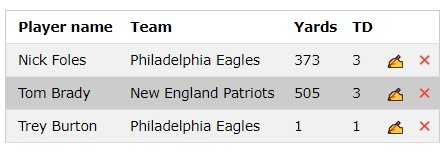
</p>
<!--  {width="4.65625in" height="1.5729166666666667in"} -->

<h6 align="center"><i>Figure 35: Hoverable table</i></h6>

We've added a new column with the HTML entity <b>&#270d;</b> to produce the
"writing hand" Edit icon and the entity <b>&#2716;</b> (with the class
<b>w3-text-red</b>) for the red Delete icon.

You can use the <b>w3-hover-color</b> classes to change the hover color to
something other than a gray background. The hover color is set on the
row level, as shown in the following code snippet.

<h6 align="center"><i>Code Listing 44</i></h6>

```
<tr>
  <td class="w3-hover-green">Nick Foles</td> ...
</tr>
<tr>
  <td class="w3-hover-blue">Tom Brady</td> ...
</tr>
```

Hovering is a simple visual indicator of which row you are going to edit
or delete.

<h3 id="ch9-2">9.2 CSS lists</h3>

HTML allows you to create lists using the <b>&lt;ul&gt;</b> (unordered list) or
<b>&lt;ol&gt;</b> (ordered list) tags with a collection of <b>&lt;li&gt;</b> tags
contained within. The basic structure is shown in the following code
snippet.

<h6 align="center"><i>Code Listing 45</i></h6>

```
<ul>
  <li>Soccer</li>
  <li>Football</li>
</ul>
```

The framework provides classes to style the lists.

<h4 id="ch9-2-1">9.2.1 Basic list style</h4>

The <b>w3-ul</b> tag sets the basic list structure and handles the
indentation of the list elements. The following code produces the list
as shown in Figure 36.

<h6 align="center"><i>Code Listing 46</i></h6>

```
<ul class="w3-ul">
  <li>Soccer</li>
  <li>Football</li>
  <li>Baseball</li>
</ul>
```

<!--~~~~~~~~~~~~~~~~~~~~~~~~~~~~~~~~~~~~~~~~~~~~~~~~~~~~~~~~~~~~~~~~~~~~~~~~~~~~~~~~~~~~~~~~~~~~-->
<!--~~~~~~~~~~~~~~~~~~~~~~~~~~~~ 43. w3 unordered list example (xx) ~~~~~~~~~~~~~~~~~~~~~~~~~~~~-->
<p align="center">
  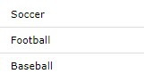
</p>
<!--  {width="1.1993055555555556in" height="0.7054724409448819in"} -->

<h6 align="center"><i>Figure 36: Basic list</i></h6>

#### Tweaking the list

You can use many of the classes to adjust the appearance of the basic
list design. These include:

-   <b>w3-border</b>: Places a border around the entire list box.

-   <b>w3-card-4</b>: Wraps the list in a shadowed card.

-   <b>w3-center</b>: Centers the elements within the list.

-   <b>w3-color</b>: Provides a color to the list.

Keep in mind that the basic list class sets the list width to 100
percent of its container. If you need to make a smaller width list, you
will need to use the CSS style to set the width.

<h6 align="center"><i>Code Listing 47</i></h6>

```
<ul class="w3-ul w3-border w3-margin" style="width:20%;" >
```

#### Hoverable list 

The <b>w3-hoverable</b> class can be added to the <b>&lt;ul&gt;</b> element to
cause a gray background to be used when the mouse hovers over one of the
list elements. You can change the background color by setting the
<b>w3-hoverable-color</b> class on any of the list elements.

#### Closable list 

You can add an X icon to the list items, and with a little JavaScript
call, give the user the ability to remove an item from the list. For
example, the following code snippet will use the <b>&times</b> HTML entity
and, when clicked, will hide the list item.

<h6 align="center"><i>Code Listing 48</i></h6>

```
<li class="w3-display-container">Baseball
  <span onclick="this.parentElement.style.display='none'"
  class="w3-button w3-display-right">&times;</span>
</li>
```

#### Adding icons to list items 

List items are not limited to just text---you can add images using the
<b>&lt;img&gt;</b> tag with the <b>w3-baritem</b> class to show an image, rather
than text. For the example, the following code snippet will add sports
images next to the sport name.

<h6 align="center"><i>Code Listing 49</i></h6>

```
<li>
  &nbsp;Soccer</li>
<li>
  &nbsp;Football</li>
<li>
  &nbsp;Baseball</li>
```

The result will appear as shown in Figure 37.

<!--~~~~~~~~~~~~~~~~~~~~~~~~~~~~~~~~~~~~~~~~~~~~~~~~~~~~~~~~~~~~~~~~~~~~~~~~~~~~~~~~~~~~~~~~~~~~-->
<!--~~~~~~~~~~~~~~~~~~~~~~~~~ 44. w3 bar w/width & height example (xx) ~~~~~~~~~~~~~~~~~~~~~~~~~-->
<p align="center">
  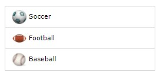
</p>
<!--  {width="2.2180555555555554in" height="1.0763888888888888in"} -->

<h6 align="center"><i>Figure 37: List with images</i></h6>
<!--~~~~~~~~~~~~~~~~~~~~~~~~~~~~~~~~~~~~~~~~~~~~~~~~~~~~~~~~~~~~~~~~~~~~~~~~~~~~~~~~~~~~~~~~~~~~-->
<!--~~~~~~~~~~~~~~~~~~~~~~~~~~~~~~~~~~ 45. light bulb logo (xx) ~~~~~~~~~~~~~~~~~~~~~~~~~~~~~~~~~~~-->
<p align="left">
  
<!--  {width="0.14333333333333334in" height="0.25in"} -->
<i><b>Tip: When using images, you will get better
performance (smaller file sizes) if you adjust the image file size,
rather than using the HTML height and width attributes to resize the
image.</b></i>
</p>

<h3 id="ch9-3">9.3 Summary</h3>

The table and list classes make it easy to style your basic tables and
lists, and are summarized as follows:

-   <b>w3-table</b>: Basic table class.

-   <b>w3-striped</b>: Adds stripes to alternate rows in a table.

-   <b>w3-border</b>: Adds a border around the entire table.

-   <b>w3-bordered</b>: Adds a border between table rows.

-   <b>w3-table-all</b>: Adds borders and striping to a table.

-   <b>w3-ul</b>: Basic list class.

<!--~~~~~~~~~~~~~~~~~~~~~~~~~~~~~~~~~~~~~~~~~~~~~~~~~~~~~~~~~~~~~~~~~~~~~~~~~~~~~~~~~~~~~~~~~~~~-->
<!--~~~~~~~~~~~~~~~~~~~~~~~~~~~~~~~~~ 46. syncfusion.com (xx) ~~~~~~~~~~~~~~~~~~~~~~~~~~~~~~~~~~-->
<p align="center">
  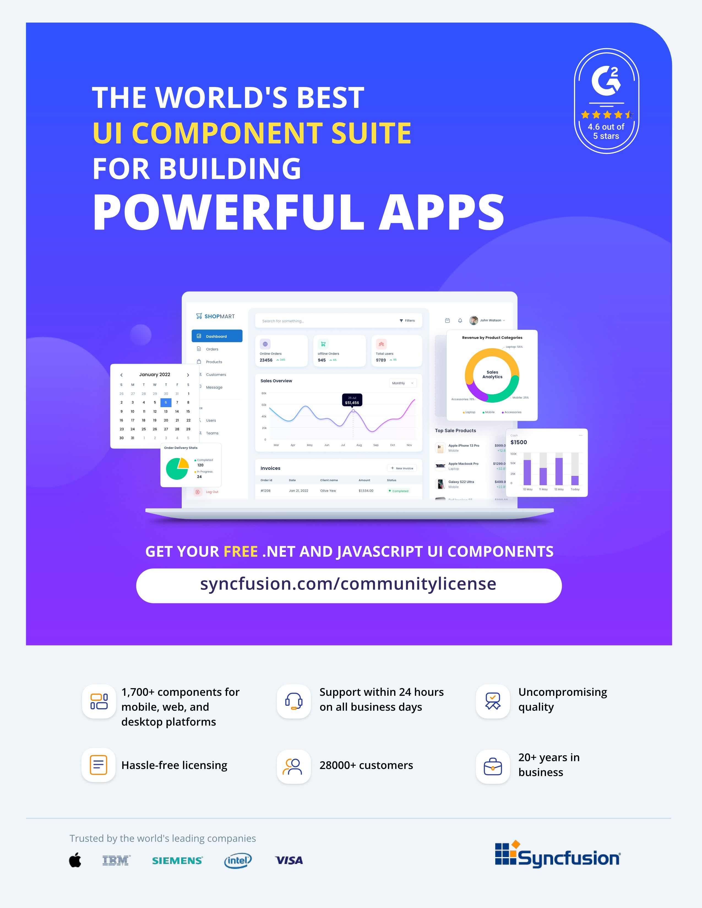
</p>
<!-- [](./images/image046.jpg) {width="8.5in" height="10.996666666666666in"} -->

<h2 id="ch10">Chapter 10 Buttons and Labels</h2>

A button element on a webpage is typically used to initiate an action or
toggle a feature. The basic HTML syntax is as follows.

<h6 align="center"><i>Code Listing 50</i></h6>

```
<input type="button"
  value="button text"
  href="#"
  onclick="javascript function">
```

If the <b>href</b> attribute is specified, it represents a link that the
user will go to when they click the button. You can also have a
JavaScript function called when the button is clicked. Note that if the
function returns <b>FALSE</b>, the <b>href</b> link will not be activated.

An alternate approach for buttons is the <b>&lt;button&gt;</b> element or an
<b>&lt;a&gt;</b> anchor element. You can use any approach to create a clickable
area on the screen.

<h3 id="ch10-1">10.1 CSS buttons</h3>

There are two basic classes available to style the button's appearance
in the framework. The <b>w3-button</b> class creates a button that will
change color when you hover over it. The <b>w3-btn</b> class creates a
button that will display a slight shadow effect when you hover over it.
Both button classes default to a black button with gray hover effects.
In addition, hovering over the button will change the cursor to a
pointer, indicating that the user can click the button.

<h4 id="ch10-1-1">10.1.1 Button variations</h4>

You can use the <b>w3-color</b> attributes to change the background and
hover colors of the buttons. For example, the following code snippet
might be used to allow the user to save or discard updates.

<h6 align="center"><i>Code Listing 51</i></h6>

<pre>
&lt;a href="save.aspx" class="w3-btn w3-green"&gt;Save changes&lt;/a&gt;
&lt;a href="discard.aspx" class="w3-btn w3-red"&gt;Discard changes&lt;/a&gt;
</pre>

<p>Figure 38 shows sample colored buttons.</p>
<!--~~~~~~~~~~~~~~~~~~~~~~~~~~~~~~~~~~~~~~~~~~~~~~~~~~~~~~~~~~~~~~~~~~~~~~~~~~~~~~~~~~~~~~~~~~~~-->
<!--~~~~~~~~~~~~~~~~~~~~~~~~~~ 47. save/discard changes button (xx) ~~~~~~~~~~~~~~~~~~~~~~~~~~~~-->
<p align="center">
  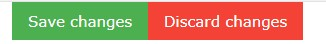
</p>
<!--  {width="3.4in" height="0.5in"} -->

<h6 align="center"><i>Figure 38: Sample buttons</i></h6>

<h4>Button colors</h4>

<p>You can add the <b>w3-color</b> or <b>w3-hover-color</b> classes to set button
colors or hover colors (the default hover color is gray).</p>

<h4>Button shapes</h4>

<p>The default shape of the buttons is a rectangle. You can use the
<b>w3-round</b> classes to add rounded corners to the buttons. The
following code snippet will produce the rounded buttons shown in Figure 39.</p>

<h6 align="center"><i>Code Listing 52</i></h6>

<pre>
&lt;div class="w3-container w3-margin"&gt;
  &lt;a href="#" class="w3-btn w3-green w3-round-xxlarge"&gt;
    Save changes&lt;/a&gt;
  &lt;a href="#" class="w3-btn w3-red w3-round-xxlarge"&gt;
    Discard changes&lt;/a&gt;
&lt;/div&gt;
</pre>
<!--~~~~~~~~~~~~~~~~~~~~~~~~~~~~~~~~~~~~~~~~~~~~~~~~~~~~~~~~~~~~~~~~~~~~~~~~~~~~~~~~~~~~~~~~~~~~-->
<!--~~~~~~~~~~~~~~~~~~~~~~ 48. rounded save/discard changes button (xx) ~~~~~~~~~~~~~~~~~~~~~~~~-->
<p align="center">
  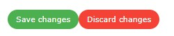
</p>
<!--  {width="2.6041666666666665in" height="0.5416666666666666in"} -->

<h6 align="center"><i>Figure 39: Rounded buttons</i></h6>

<h4>Disabled buttons</h4>

Buttons have a visual effect, either background color change or shadowing, as well as the 
cursor changing to indicate the button is clickable. If a button needs to be disabled, you 
can add the <b>w3-disabled</b> class to the button. This will cause the button to have a 
grayed-out appearance and disable the cursor when the user moves the mouse over the button.

<!--~~~~~~~~~~~~~~~~~~~~~~~~~~~~~~~~~~~~~~~~~~~~~~~~~~~~~~~~~~~~~~~~~~~~~~~~~~~~~~~~~~~~~~~~~~~~-->
<!--~~~~~~~~~~~~~~~~~~~~~~~~~~~~~~~ 49. orange light bulb (xx) ~~~~~~~~~~~~~~~~~~~~~~~~~~~~~~~~~-->
<p align="left">

<i><b>Tip: You might want to dynamically add the w3-disabled class via JavaScript when the 
button is clicked. This could provide a visual indication that the button has been pressed 
and the action is being performed. Remove the class when the work is complete.</b></i>
</p>

<!--
>  {width="0.14333333333333334in" height="0.25in"}
> <i><b>Tip: You might want to dynamically add the</b>
> w3-disabled <b>class via JavaScript when the button is clicked. This
> could provide a visual indication that the button has been pressed and
> the action is being performed. Remove the class when the work is
> complete.</b></i>
-->

<h4>Ripple effect</h4>

A ripple effect is a visual effect that indicates the button has been
clicked, providing some feedback to the user. It is considered good UX
design to make sure the user knows that the button has been clicked. You
can add the <b>w3-ripple</b> class to any button to provide this effect.

<h3 id="ch10-2">10.2 CSS badges</h3>

A badge is a circular label, typically containing a number, which
indicates how many items are found in some collection. The W3.CSS
framework has a single class, <b>w3-badge</b>, that will create a circular
badge with a black background.

You can use the <b>w3-color</b> and <b>w3-size</b> classes to control the
color and size of the badge element. The following code snippet creates
the badges shown in Figure 40.

<h6 align="center"><i>Code Listing 53</i></h6>

```
<div class="w3-container w3-margin" style="width:18%;">
  <p>w3-badge <span class="w3-badge w3-right">9</span></p>
  <p>w3-badge w3-red
    <span class="w3-badge w3-red w3-right">4</span></p>
  <p>w3-badge w3-red w3-large
    <span class="w3-badge w3-blue w3-right w3-large">2</span></p>
</div>
```

<!--~~~~~~~~~~~~~~~~~~~~~~~~~~~~~~~~~~~~~~~~~~~~~~~~~~~~~~~~~~~~~~~~~~~~~~~~~~~~~~~~~~~~~~~~~~~~-->
<!--~~~~~~~~~~~~~~~~ 50.  (xx) ~~~~~~~~~~~~~~~~~-->
<p align="center">
  
</p>
<!--  {width="2.5416666666666665in" height="1.0520833333333333in"} -->

<h6 align="center"><i>Figure 40: Badge examples</i></h6>

<h4 id="ch10-2-1">10.2.1 Badges within other elements</h4>

The <b>w3-badge</b> class can be used within other elements using a
<b>&lt;span&gt;</b> tag. For example, we might have a list of customers and use
the badge to indicate number of orders.

<h6 align="center"><i>Code Listing 54</i></h6>

```
<div class="w3-container w3-margin" style="width:18%;">
  <ul class="w3-ul w3-border">
    <li>Christy
      <span class="w3-badge w3-right w3-margin-right">4</span></li>
    <li>Rachel
      <span class="w3-badge w3-right w3-margin-right">8</span></li>
    <li>Alyssa
      <span class="w3-badge w3-right w3-margin-right">3</span></li>
  </ul>
</div>
```

This code snippet produces the list shown in Figure 41.

<!--~~~~~~~~~~~~~~~~~~~~~~~~~~~~~~~~~~~~~~~~~~~~~~~~~~~~~~~~~~~~~~~~~~~~~~~~~~~~~~~~~~~~~~~~~~~~-->
<!--~~~~~~~~~~~~~~~~ 51.  (xx) ~~~~~~~~~~~~~~~~~-->
<p align="center">
  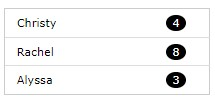
</p>
<!--  {width="2.2395833333333335in" height="1.0208333333333333in"} -->

<h6 align="center"><i>Figure 41: Badges with list elements</i></h6>

<h3 id="ch10-3">10.3 CSS tags</h3>

Tags are labels on a site, typically used to label some element on the
screen. The W3.CSS framework provides the <b>w3-tag</b> class to format the
label. The following code snippet shows a tag that displays the status
of the current operation.

<h6 align="center"><i>Code Listing 55</i></h6>

```
<div class="w3-container>
  <p>Status: <span class="w3-tag w3-green">Processing</span></p>
</div>
```

<!--~~~~~~~~~~~~~~~~~~~~~~~~~~~~~~~~~~~~~~~~~~~~~~~~~~~~~~~~~~~~~~~~~~~~~~~~~~~~~~~~~~~~~~~~~~~~-->
<!--~~~~~~~~~~~~~~~~~~~~~~~~~~ 52. status: processing, example (xx) ~~~~~~~~~~~~~~~~~~~~~~~~~~~~-->
<p align="center">
  
</p>
<!--  {width="1.3229166666666667in" height="0.3645833333333333in"} -->

<h6 align="center"><i>Figure 42: Processing tag</i></h6>

<h4 id="ch10-3-1">10.3.1 Customizing the tags</h4>

You can use the various <b>w3</b> helper classes to customize the
appearance of a tag. For example, the following code snippet adds
several helper classes to produce a warning tag.

<h6 align="center"><i>Code Listing 56</i></h6>

```
<div class="w3-container">
  <span class="w3-tag w3-red w3-center w3-round-large w3-padding">
    The thermal printer should only be<br/>
	used to print prescriptions sheets.
  </span>
</div>
```

<!--~~~~~~~~~~~~~~~~~~~~~~~~~~~~~~~~~~~~~~~~~~~~~~~~~~~~~~~~~~~~~~~~~~~~~~~~~~~~~~~~~~~~~~~~~~~~-->
<!--~~~~~~~~~~~~~~~~~~~~~~~~~~~~~~ 53. w3 container, example (xx) ~~~~~~~~~~~~~~~~~~~~~~~~~~~~~~-->
<p align="center">
  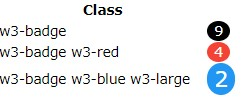
</p>
<!--  {width="2.40625in" height="0.6145833333333334in"} -->

<h6 align="center"><i>Figure 43: Warning tag</i></h6>

<h3 id="ch10-4">10.4 Summary</h3>

The button, badge, and tag classes make it easy to style your contents,
and are summarized as follows:

-   <b>w3-button</b>: Basic button with gray background on hover.

-   <b>w3-btn</b>: Button with shadow effect on hover.

-   <b>w3-badge</b>: Creates a circular "badge" effect.

-   <b>w3-tag</b>: Creates a tag or label effect.

<h2 id="ch11">Chapter 11 Forms</h2>

Many web applications need to collect information from the user, and
HTML provides a variety of elements to enter information into the site.
The W3.CSS framework provides classes to create a consistent appearance
for these elements.

Figure 44 shows a sample input form, formatted with W3 classes.

<!--~~~~~~~~~~~~~~~~~~~~~~~~~~~~~~~~~~~~~~~~~~~~~~~~~~~~~~~~~~~~~~~~~~~~~~~~~~~~~~~~~~~~~~~~~~~~-->
<!--~~~~~~~~~~~~~~~~~~~~~~~~~~~~~~~ 54. contact us, example (xx) ~~~~~~~~~~~~~~~~~~~~~~~~~~~~~~~-->
<p align="center">
  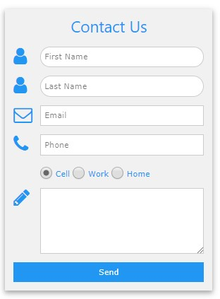
</p>
<!--  {width="3.142361111111111in" height="4.260277777777778in"} -->

<h6 align="center"><i>Figure 44: Sample input form</i></h6>

<h3 id="ch11-1">11.1 Text boxes</h3>

Text boxes are used to allow the user to enter freeform text into a
form. The basic syntax is as follows.

<h6 align="center"><i>Code Listing 57</i></h6>

```
<input type="text" class="w3-input">
```

The <b>w3-input</b> class provides the basic formatting for a text box,
providing the necessary padding and borders.

<!--~~~~~~~~~~~~~~~~~~~~~~~~~~~~~~~~~~~~~~~~~~~~~~~~~~~~~~~~~~~~~~~~~~~~~~~~~~~~~~~~~~~~~~~~~~~~-->
<!--~~~~~~~~~~~~~~~~~~~~~~~~~~~~~~~~~~~~ 08. note logo (xx) ~~~~~~~~~~~~~~~~~~~~~~~~~~~~~~~~~~~~-->
<p align="center">
  
 <!-- {width="0.25in" height="0.28958333333333336in"} -->
<i><b>Note: HTML5 introduces several new
input types besides the basic text input. The following types are
supported:</b></i>
</p>

-   <i><b>date: Display a date editor.</b></i>
-   <i><b>email: Get an email address.</b></i>
-   <i><b>number: A numeric spinner.</b></i>
-   <i><b>range: A slider between two numeric values.</b></i>
-   <i><b>tel: Get a phone number.</b></i>
-   <i><b>color: A color picker.</b></i>
-   <i><b>datetime-local: Enter a date/time, and no time zone.</b></i>
-   <i><b>month: Select a month and year.</b></i>
-   <i><b>search: A text box for searching.</b></i>
-   <i><b>time: A box to select a time and a.m. or p.m.</b></i>
-   <i><b>url: A text box that expects input to look like a URL.</b></i>
-   <i><b>week: Pick a week and year.</b></i>

> <i><b>If a browser does not support one of the new types, it will fall
> back to text input. Also, many mobile devices will change the virtual
> keyboard to accommodate the input type.</b></i>

<h4 id="ch11-1-1">11.1.1 Text box options</h4>

You can use the <b>w3</b> helper classes to change the appearance of the
input text box. For example, the following code snippet produces our
rounded input boxes in the sample.

<h6 align="center"><i>Code Listing 58</i></h6>

```
<input type="text" class="w3-input w3-border w3-round-xxlarge"
  name="first" placeholder="First Name">
```

A recent trend in text input is not to use borders at all around text.
You can use the <b>w3-border0</b> class to achieve that look (shown in
figure 45).

<!--~~~~~~~~~~~~~~~~~~~~~~~~~~~~~~~~~~~~~~~~~~~~~~~~~~~~~~~~~~~~~~~~~~~~~~~~~~~~~~~~~~~~~~~~~~~~-->
<!--~~~~~~~~~~~~~~~~~~~~~~~ 55. w3 input first, last name example (xx) ~~~~~~~~~~~~~~~~~~~~~~~~~-->
<p align="center">
  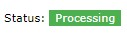
</p>
<!--  {width="2.46875in" height="0.5104166666666666in"} -->

<h6 align="center"><i>Figure 45: Borderless input</i></h6>

While text elements are very common and easy for the user to understand,
the lack of constraints on what the user can enter makes it more
difficult for the code to process. When possible, use the HTML5 types
with constraints and provide placeholder examples of how the user should
populate the text boxes.

<h3 id="ch11-2">11.2 Option buttons</h3>

Option buttons (also referred to as radio buttons) present a list of
choices to the user and allow them to pick only one. They appear as
circular buttons with labels next to each option. Figure 46 shows sample
option buttons.

<!--~~~~~~~~~~~~~~~~~~~~~~~~~~~~~~~~~~~~~~~~~~~~~~~~~~~~~~~~~~~~~~~~~~~~~~~~~~~~~~~~~~~~~~~~~~~~-->
<!--~~~~~~~~~~~~~~~~~~~~~~~~~~ 56. radio/option buttons example (xx) ~~~~~~~~~~~~~~~~~~~~~~~~~~~-->
<p align="center">
  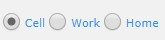
</p>
<!--  {width="1.71875in" height="0.4166666666666667in"} -->

<h6 align="center"><i>Figure 46: Option buttons</i></h6>

The <b>w3-radio</b> class formats the option buttons. The following code
snippet shows how to create a group of buttons.

<h6 align="center"><i>Code Listing 59</i></h6>

```
<input type="radio" class="w3-radio" name="phoneType" value="cell" checked>
  <label>Cell</label>
<input type="radio" class="w3-radio" name="phoneType" value="work">
  <label>Work</label>
<input type="radio" class="w3-radio" name="phoneType" value="home">
  <label>Home</label>
```

All elements within the option group must have the same <b>name</b>
attribute value. This allows the browser to enforce only one item within
the group being selectable.

>  <!-- {width="0.25in" height="0.28958333333333336in"} -->
> <i><b>Note: Option buttons were originally
> called radio buttons because most older cars had buttons on the radio,
> designed so that when one button was pushed, the other buttons would
> automatically pop up (see Figure 47). Many younger developers were not
> familiar with the meaning, since very few cars still use radio
> buttons---hence the new name, option buttons.</b></i>

<!--~~~~~~~~~~~~~~~~~~~~~~~~~~~~~~~~~~~~~~~~~~~~~~~~~~~~~~~~~~~~~~~~~~~~~~~~~~~~~~~~~~~~~~~~~~~~-->
<!--~~~~~~~~~~~~~~~~~~~~~~~~~~~~~~~~~ 57. radio, example (xx) ~~~~~~~~~~~~~~~~~~~~~~~~~~~~~~~~~~-->
<p align="center">
  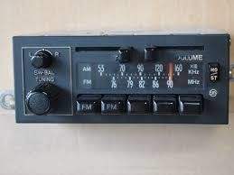
</p>
<!--  {width="2.6979166666666665in" height="2.0208333333333335in"} -->

<h6 align="center"><i>Figure 47: Radio buttons</i></h6>

<h3 id="ch11-3">11.3 Check boxes</h3>

Check boxes are like option buttons, except that the user can check more
than one. The element for check boxes is a square, to distinguish them
from option buttons. Figure 48 shows how check boxes appear on the form.

<!--~~~~~~~~~~~~~~~~~~~~~~~~~~~~~~~~~~~~~~~~~~~~~~~~~~~~~~~~~~~~~~~~~~~~~~~~~~~~~~~~~~~~~~~~~~~~-->
<!--~~~~~~~~~~~~~~~~ 58.  (xx) ~~~~~~~~~~~~~~~~~-->
<p align="center">
  
</p>
<!--  {width="3.9in" height="0.4in"} -->

<h6 align="center"><i>Figure 48: Check boxes</i></h6>

The following code creates the check boxes.

<h6 align="center"><i>Code Listing 60</i></h6>

```
<input type="checkbox" class="w3-check" checked>
  <label>Overnight shipping</label>
<input type="checkbox" class="w3-check" >
  <label>Insurance</label>
<input type="checkbox" class="w3-check" >
  <label>Signature required</label>
```

The <b>w3-check</b> class provides the formatting for check boxes.

<h3 id="ch11-4">11.4 Select elements</h3>

Check boxes and option buttons are good elements to use if your number
of choices is relatively small. For a larger number of choices, you
should consider a select box. To create the box, you declare the
<b>&lt;select&gt;</b> element wrapper, and then include <b>&lt;option&gt;</b>
elements. The following code snippet shows how to design a select list.
The <b>w3-select</b> class provides the formatting. In the following
example, we added a <b>w3-border</b> class to improve the appearance of the
box.

<h6 align="center"><i>Code Listing 61</i></h6>

```
<select class="w3-select w3-border" name="option">
  <option value= "" disabled selected>Choose your option</option>
  <option value= "1">Reduced interest rate</option>
  <option value= "2">Longer payment terms</option>
  <option value= "3">Cash rebate</option>
</select>
```

Figure 49 shows a select box produced from this code snippet.

<!--~~~~~~~~~~~~~~~~~~~~~~~~~~~~~~~~~~~~~~~~~~~~~~~~~~~~~~~~~~~~~~~~~~~~~~~~~~~~~~~~~~~~~~~~~~~~-->
<!--~~~~~~~~~~~~~~~~~~~~~~~~~~~~~~ 59. select box, example (xx) ~~~~~~~~~~~~~~~~~~~~~~~~~~~~~~~~-->
<p align="center">
  
</p>
<!--  {width="2.875in" height="0.9583333333333334in"} -->

<h6 align="center"><i>Figure 49: Select box</i></h6>

<h4 id="ch11-4-1">11.4.1 Adding labels</h4>

You can add labels around the input elements, using either text or icons
and images. In the following code snippet, we are using the <b>w3-row</b>
and <b>w3-col</b> classes to split the screen between the label and the
input element.

<h6 align="center"><i>Code Listing 62</i></h6>

```
<div class="w3-section w3-row">
  <div class="w3-col" style="width:50px;">
    <i class="w3-col fa fa-envelope-o"></i></div>
    <div class="w3-rest">
    <input class="w3-input w3-border" type="email" 
      name="email" placeholder="Email address" >
  </div>
</div>
```

This example uses the Font Awesome library to provide an envelope icon.
You could also use the HTML Entity code <b>&#9993;</b> to produce an
envelope icon.

<h3 id="ch11-5">11.5 Summary</h3>

The following classes are used to format input elements:

-   <b>w3-input</b>: Text input class

-   <b>w3-radio</b>: Radio (option) buttons

-   <b>w3-check</b>: Check boxes

-   <b>w3-select</b>: Select list

<h2 id="ch12">Chapter 12 Animations</h2>

Animation is a CSS technique that causes elements to gradually appear on
the website. Judicious use of animation can make a website seem
friendlier. For most people, things that appear suddenly in front of us
are startling, and possibly dangerous. A dialog box that gradually fades
in can provide a smooth, less jarring interface.

<h3 id="ch12-1">12.1 Animating elements</h3>

To animate any element's appearance on the page, you simply need to add
the class indicating how you want the element to appear. There are
several classes for animation.

<h4 id="ch12-1-1">12.1.1 Directions</h4>

You can animate the element from the top or bottom, or from either side.
The following classes are used for directional animation:

-   <b>w3-animate-top</b>: Slides element down from the top.

-   <b>w3-animate-bottom</b>: Slides element up from the bottom.

-   <b>w3-animate-left</b>: Slides element from the left side.

-   <b>w3-animate-right</b>: Slides element from the right side.

<h4 id="ch12-1-2">12.1.2 Zooming</h4>

The zooming animation gradually increases the element's size from 0 to
100 percent. The animation occurs over six-tenths of a second. The
<b>w3-animate-zoom</b> class attached to the element performs the zooming
animation.

<h4 id="ch12-1-3">12.1.3 Opacity</h4>

Opacity is a setting that determines how transparent an element appears
on the screen. A setting of <b>1</b> is totally opaque. Lower values create
a translucent effect on the element. The W3.CSS framework provides two
classes to animate the opacity of the element.

<h5>Animate opacity</h5>

Adding the <b>w3-animate-opacity</b> class causes a fade-in effect, where
the element goes from totally translucent (invisible) to opaque in 1.5
seconds. You can use this effect with a modal dialog to gradually bring
up the dialog box.

<h5>Fading</h5>

The <b>w3-animate-fading</b> class creates a fade-in and then fade-out
effect on the element, where the opacity will go from 0 to 1 in 1.5
seconds, and then from 1 to 0 again.

<h3 id="ch12-2">12.2 Spinner</h3>

The <b>w3-spin</b> class causes the element to rotate 360 degrees and can
be used to suggest to a user that a process is running. If you install
Font Awesome, there are a few icons that make effective spinners to
indicate a process is running. The code snippet below shows a spinning
icon.

<h6 align="center"><i>Code Listing 63</i></h6>

```
<div class="w3-section w3-row">
  <div class="w3-col" style="width:50px;">
  <i class="w3-xxlarge w3-spin fa fa-spinner"></i></div>
  <div class="w3-rest">Saving&hellip;</div>
</div>
```

Figure 50 shows the screen (but on a website, the spinner will keep rotating).
<!--~~~~~~~~~~~~~~~~~~~~~~~~~~~~~~~~~~~~~~~~~~~~~~~~~~~~~~~~~~~~~~~~~~~~~~~~~~~~~~~~~~~~~~~~~~~~-->
<!--~~~~~~~~~~~~~~~~~~~~~~~~~~~~~~~ 60. saving..., example (xx) ~~~~~~~~~~~~~~~~~~~~~~~~~~~~~~~~-->
<p align="center">
  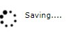
</p>
<!-- {width="1.0104166666666667in" height="0.5in"} -->


<h6 align="center"><i>Figure 50: Sample spinner</i></h6>

<!--~~~~~~~~~~~~~~~~~~~~~~~~~~~~~~~~~~~~~~~~~~~~~~~~~~~~~~~~~~~~~~~~~~~~~~~~~~~~~~~~~~~~~~~~~~~~-->
<!--~~~~~~~~~~~~~~~~~~~~~~~~~~~~~~~~~ 61. light bulb logo (xx) ~~~~~~~~~~~~~~~~~~~~~~~~~~~~~~~~~-->
<p align="left">
  
<!-- {width="0.1597222222222222in" height="0.32943022747156603in"} -->
<i><b>Tip: Spinners are often used during
Ajax calls, to show something is happening. However, be sure that if
an error occurs, the spinner is removed. Otherwise, users see the
spinner still moving, and complain about performance.</b></i>
</p>

<h3 id="ch12-3">12.3 Summary</h3>

Animation can improve the general feel of a site, making your pop-up
dialog boxes appear smoother, and allowing you to show processing
activities. The W3.CSS animation classes make it easy to add animation.

If the animation speed is too fast or slow, you can easily clone the
base CSS classes and create a <b>w3-animate-zoom-slowly</b> class, simply
by adjusting the number of seconds that the animation takes. If you
consider this approach, be sure to create a separate CSS so you won't
lose your changes if you update the W3.CSS framework.

<h2 id="ch13">Chapter 13 Modals</h2>

Modal dialogs are pop-up windows that appear on a website, overwriting
the content beneath the dialog. In general, they are forms for the user
to complete for tasks such as editing a customer or selecting airlines.
W3.CSS allows you to create a modal form and keep it hidden until some
button or action triggers the modal to display.

<h3 id="ch13-1">13.1 Creating a modal dialog</h3>

To create a modal dialog, you need to use the <b>w3-modal</b> class for the
container <b>&lt;div&gt;</b> that will hold the modal dialog's contents. You
will also need to ensure that this container has a unique ID, since
you'll need it to open the modal dialog. The following code snippet
shows the basic setup for the modal container.

<h6 align="center"><i>Code Listing 64</i></h6>

```
<div id="ContactUs" class="w3-modal w3-center">
</div>
```

The actual content of the modal dialog is wrapped within the
<b>w3-modal-content</b> class. The wrapper structure looks as shown in the
following.

<h6 align="center"><i>Code Listing 65</i></h6>

```
<div id="ContactUs" class="w3-modal w3-center">
  <div class="w3-modal-content">
  <!-- Actual modal content -->
  </div>
</div>
```

<h3 id="ch13-2">13.2 Displaying the modal</h3>

To display the modal dialog, you will need some simple JavaScript and a
button. For example, if we wanted to display the Contact Us modal
dialog, we could use the following code.

<h6 align="center"><i>Code Listing 66</i></h6>

```
<button onclick="document.getElementById('ContactUs').style.display='block'"
  class="w3-button">
</button>
```

When the user clicks the <b>Contact Us</b> button, the modal dialog's
display style is set to <b>block</b>, causing the dialog to pop up on the
user screen.

<h3 id="ch13-2-1">13.2.1 Animating the display</h4>

The modal dialog will suddenly pop up on the screen. While this is
common in websites, it can sometimes have a jarring effect. You can take
advantage of the animation classes to present a smoother appearance of
the modal. Simply add the desired animation class to the container
<b>&lt;div&gt;</b>, as follows.

<h6 align="center"><i>Code Listing 67</i></h6>

```
<div id="ContactUs" class="w3-modal w3-center w3-animate-opacity">
</div>
```

This will cause the modal dialog to fade in, rather than just quickly
appear.

<h3 id="ch13-3">13.3 Closing the modal dialog</h3>

Once the modal dialog is opened, it will stay on the screen (since the
display style is now set to <b>block</b>). You will need to add some
imbedded JavaScript code to allow the user to close the modal dialog.
Typically, this is triggered by clicking the X icon in the upper-right
corner, although if the modal dialog saves information, you would put
the close code into the buttons that save and/or cancel the dialog.

<h6 align="center"><i>Code Listing 68</i></h6>

```
<header class="w3-teal w3-display-container">
  <span onclick="document.getElementById('ContactUs').style.display='none'"
    class="w3-button w3-large w3-display-topright">&times;</span>
  <h2>Contact Us</h2>
</header>
```

<h3 id="ch13-4">13.4 Summary</h3>

Modal dialogs are typically used to overlay the website and provide a
dialog for the user to focus on. The framework requires a little
additional markup and some JavaScript to open and close the dialog.

Animating the dialog opening will add a smoother feel to the site, and
you should consider adding one of the animation classes to the modal
container.

<h2 id="ch14">Chapter 14 Images</h2>

You can use the <b>&lt;img&gt;</b> tag to display a picture on a website. The
W3.CSS framework provides several classes that can be used to control
the image's borders and appearance.

<h3 id="ch14-1">14.1 CSS Images</h3>

Here is the HTML to display an image.

<h6 align="center"><i>Code Listing 69</i></h6>

```
<div class="w3-container w3-margin">
  
</div>
```

This will produce the image shown in Figure 51.

<!--~~~~~~~~~~~~~~~~~~~~~~~~~~~~~~~~~~~~~~~~~~~~~~~~~~~~~~~~~~~~~~~~~~~~~~~~~~~~~~~~~~~~~~~~~~~~-->
<!--~~~~~~~~~~~~~~~~~~~~~~~~~~ 62. grandpa cuddling grandaughter (xx) ~~~~~~~~~~~~~~~~~~~~~~~~~~-->
<p align="center">
  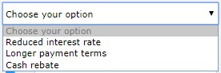
</p>
<!--  {width="1.0972222222222223in" height="1.426388888888889in"} -->

<h6 align="center"><i>Figure 51: Grandpa cuddles</i></h6>

We can use the following classes to control how the image appears on the
page:

-   <b>w3-circle</b>: Places the image in a circle.

-   <b>w3-rounded</b>: Adds rounded corners.

-   <b>w3-bordered</b>: Adds a border around entire image.

<!--~~~~~~~~~~~~~~~~~~~~~~~~~~~~~~~~~~~~~~~~~~~~~~~~~~~~~~~~~~~~~~~~~~~~~~~~~~~~~~~~~~~~~~~~~~~~-->
<!--~~~~~~~~~~~~~~ 63. image in circle, rounded, and with border, examples (xx) ~~~~~~~~~~~~~~~~-->
<p align="center">
  
</p>
<!--  {width="3.672083333333333in" height="1.5840277777777778in"} -->

<h6 align="center"><i>Figure 52: Sample image classes</i></h6>

<h4 id="ch14-1-1">14.1.1 Responsive images</h4>

You can add the <b>w3-image</b> class to the <b>&lt;img&gt;</b> tag to create a
responsive image. The image size will adjust to the screen, but will
never be larger than the original image size.

<!--~~~~~~~~~~~~~~~~~~~~~~~~~~~~~~~~~~~~~~~~~~~~~~~~~~~~~~~~~~~~~~~~~~~~~~~~~~~~~~~~~~~~~~~~~~~~-->
<!--~~~~~~~~~~~~~~~~~~~~~~~~~~~~~~ 08. light bulb logo/icon (xx) ~~~~~~~~~~~~~~~~~~~~~~~~~~~~~~~-->
<p align="center">
  
<!--  {width="0.25in" height="0.28958333333333336in"} -->
<i><b>Note: If you want a full responsive
image (meaning it can be larger than original size), you need to set
the width property to</b> 100% <b>(via an inline style).</b></i>
</p>

<h4 id="ch14-1-2">14.1.2 Image opacity</h4>

You can use the opacity classes to set the opacity of the image from 25
percent to 75 percent. The class names are:

-   <b>w3-opacity-min</b>: 75 percent opacity

-   <b>w3-opacity</b>: 50 percent opacity

-   <b>w3-opacity-max</b>: 25 percent opacity

Figure 53 shows the various opacity effects.

<!--~~~~~~~~~~~~~~~~~~~~~~~~~~~~~~~~~~~~~~~~~~~~~~~~~~~~~~~~~~~~~~~~~~~~~~~~~~~~~~~~~~~~~~~~~~~~-->
<!--~~~~~~~~~~~~~~~~~~~~~~~~ 64. various opacity effects, examples (xx) ~~~~~~~~~~~~~~~~~~~~~~~~-->
<p align="center">
  
</p>
<!--  {width="2.73125in" height="1.0832633420822397in"} -->

<h6 align="center"><i>Figure 53: Image opacity</i></h6>

<h4 id="ch14-1-3">14.1.3 Grayscale</h4>

You can use the grayscale classes to set the level of grayscale for an
image. The class names are:

-   w3-grayscale-min: Minimal grayscale effect.

-   w3-grayscale: Mostly grayscale image.

-   w3-grayscale: Full grayscale effect.

Figure 54 shows the grayscale effect on an image.

<!--~~~~~~~~~~~~~~~~~~~~~~~~~~~~~~~~~~~~~~~~~~~~~~~~~~~~~~~~~~~~~~~~~~~~~~~~~~~~~~~~~~~~~~~~~~~~-->
<!--~~~~~~~~~~~~~~~~~~~~~~ 65. grayscale effect on an image, example (xx) ~~~~~~~~~~~~~~~~~~~~~~-->
<p align="center">
  
</p>
<!--  {width="3.533333333333333in" height="1.260181539807524in"} -->

<h6 align="center"><i>Figure 54: Grayscale</i></h6>

<h4 id="ch14-1-4">14.1.4 CSS slideshow</h4>

You can use the W3.CSS framework and a bit of JavaScript to create a
slideshow of images. Figure 55 shows the basic appearance of the
slideshow. The user can click the buttons to move among the images in
the slideshow.

<!--~~~~~~~~~~~~~~~~~~~~~~~~~~~~~~~~~~~~~~~~~~~~~~~~~~~~~~~~~~~~~~~~~~~~~~~~~~~~~~~~~~~~~~~~~~~~-->
<!--~~~~~~~~~~~~~~~~~~~~~~ 66. slideshow image with arrows example (xx) ~~~~~~~~~~~~~~~~~~~~~~~~-->
<p align="center">
  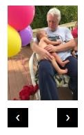
</p>
<!--  {width="1.2708333333333333in" height="2.03125in"} -->

<h6 align="center"><i>Figure 55: Slideshow</i></h6>

<h4 id="ch14-1-5">14.1.5 Setting the images</h4>

The first step is to add the images you want to view and assign them the
same class name.

The following snippet shows the image setup and the two buttons for
navigation.

<h6 align="center"><i>Code Listing 70</i></h6>

```
<div class="w3-display-container w3-content" style="width:8%;">
  
  
  <p>
    <button class="w3-button w3-black"
      onclick="plusDivs(-1)">&#10094;</button>
	<button class="w3-button w3-black"
      onclick="plusDivs(1)">&#10095;</button>
  </p>
</div>
```

The HTML entities are used for the buttons to provide the navigation
arrows. We will need a JavaScript function called <b>plusDivs()</b> to move
among the images.

<h4 id="ch14-1-6">14.1.6 JavaScript code</h4>

The following is the code that needs to be added within a script tag in
the <b>&lt;head&gt;</b> section of the website to allow the navigation between
images.

<h6 align="center"><i>Code Listing 71</i></h6>

```
<script>
  var slideIndex =1;
  showDivs(1);

function plusDivs(n) {
  showDivs(slideIndex += n);
}

function showDivs(n) {
  var x = document.getElementsByClaseName('mySlides');
  if (n > x.length) { xslideIndex =1;} 
  if (n < 1) { slideIndex =x.length;} 
  for (var i=0; i < x.length; i++) {
    x[i].style.display ="none";
    x[i].style.display ="block";
  }
}
</script>
```

The script declares a variable (<b>slideIndex</b>) to keep track of the
currently selected image and initializes it to the first image. The
buttons will call the <b>plusDivs()</b> function with a parameter
indicating the next image to display.

<b>ShowDivs()</b> will simply set the display style of all the images to
<b>none</b>, and then set the selected image's style to <b>block</b>, causing
it to be shown.

<h3 id="ch14-2">14.2 Summary</h3>

W3.CSS provides classes to control the appearance and shape of images,
and makes it very easy to create a slideshow of your image collection
with minor JavaScript.

<h2 id="ch15">Chapter 15 W3.CSS Example Code</h2>

We've covered a lot of classes and examples in this book. In this
chapter, we will explore in detail one of the examples from the W3.CSS
site. The email template is a good, simple demo of a responsive website
for a mail client. Figure 56 shows the sample template.
<!--~~~~~~~~~~~~~~~~~~~~~~~~~~~~~~~~~~~~~~~~~~~~~~~~~~~~~~~~~~~~~~~~~~~~~~~~~~~~~~~~~~~~~~~~~~~~-->
<!--~~~~~~~~~~~~~~~~~~~~~~~ 67. w3 css responsive website example (xx) ~~~~~~~~~~~~~~~~~~~~~~~~~-->
<p align="center">
  
</p>
<!-- {width="6.5in" height="2.5840277777777776in"} -->

<h6 align="center"><i>Figure 56: Email template</i></h6>

<h3 id="ch15-1">15.1 Head section</h3>

The <b>&lt;head&gt;</b> section of most templates will look very much the same,
including the W3.CSS style sheet, possibly using an external web font.

<h6 align="center"><i>Code Listing 72</i></h6>

```
<!DOCTYPE html>
<html>
<head>
  <title>W3.CSS </title>
  <meta charset="UTF-8">
  <meta name="viewport" content="width=device-width, initial-scale=1">
  <link rel="stylesheet" type="text/css"
    href="https://fonts.googleapis.com/css?family=RobotoDraft">
```

In this example, we are using a Google font called <b>RobotoDraft</b>, and
linking it into our website. While the use of external web fonts is
optional, you can improve the overall look of the site easily with
minimal code changes.

<h4 id="ch15-1-1">15.1.1 Font Awesome</h4>

Font Awesome is a very popular library of icons, defined as CSS classes.
You can explore the <a href="https://fontawesome.com/">library here</a>.

To add Font Awesome to the site, the following line is added to the
<b>&lt;head&gt;</b> section.

<h6 align="center"><i>Code Listing 73</i></h6>

```
<link rel="stylesheet" type="text/css"
  href="https://cdnjs.cloudfare.com/ajax/libs/font-awesome/
  4.7.0/css/font-awesome.min.css">
```

To use the fonts, you simply add the class name to any element, and
the appropriate icon will appear. The following example shows some
Save and Cancel buttons taking advantage of the Font Awesome library.

<h6 align="center"><i>Code Listing 74</i></h6>

```
<button class="fa fa-save w3-text-green w3-xlarge w3-padding">
  &nbsp;Save changes</button>
<button class="fa fa-times w3-text-red w3-xlarge w3-padding">
  &nbsp;Cancel</button>
```

This produces the buttons shown in Figure 57.
<!--~~~~~~~~~~~~~~~~~~~~~~~~~~~~~~~~~~~~~~~~~~~~~~~~~~~~~~~~~~~~~~~~~~~~~~~~~~~~~~~~~~~~~~~~~~~~-->
<!--~~~~~~~~~~~~~~~~~~~~~~~~~~ 68. save changes & cancel buttons (xx) ~~~~~~~~~~~~~~~~~~~~~~~~~~-->
<p align="center">
  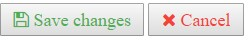
</p>
<!-- > {width="2.5833333333333335in" -->
<!-- > height="0.4166666666666667in"} -->

<h6 align="center"><i>Figure 57: Font Awesome buttons</i></h6>

<h4 id="ch15-1-2">15.1.2 HTML entities</h4>

Throughout the course of this book, we also took advantage of some HTML
entities to add small icons to a few of our examples. Some useful HTML
entities are:

-   <b>&#9776;</b> Hamburger menu

-   <b>&#128197;</b> Calendar

-   <b>&#128269;</b> Search icon

-   <b>&#9998;</b> Edit pencil

-   <b>&#2716;</b> Cancel icon

-   <b>&#2702;</b> Scissors

-   <b>&#9742;</b> Telephone

-   <b>&#10683;</b> Circle with X

While HTML entities are easy to use, not all entities will work with all fonts. Be sure to 
test your entities against your website font or use the Font Awesome library, which imbeds 
its own font.

<h4 id="ch15-1-3">15.1.3 Setting the font family</h4>

The final step when using a web font is to adjust the styles on various elements to use 
the new font family. The final piece of code in the <b>&lt;head&gt;</b> section does that.

<h6 align="center"><i>Code Listing 75</i></h6>

```
<style>
  html, body, h1, h2, h3, h4, h5, h6 {
    font-family: "RobotoDraft","Roboto", sans-serif;
  }
  .w3-bar-block, .w3-bar-item { padding:16px; }
</style>
```

<h3 id="ch15-2">15.2 Body section</h3>

The body section consists of a sidebar menu for navigation among the email folders (the 
inbox, sent items, drafts, and deleted items). Note that there is no implementation code 
for these folders; it would typically be an Ajax call to gather all the items within the 
folder and display them.

<h4 id="ch15-2-1">15.2.1 Sidebar</h4>

The following code creates the sidebar navigation menu (some classes are removed for 
readability).

<h6 align="center"><i>Code Listing 76</i></h6>

```
<nav class="w3-sidebar w3-bar-block w3-collapse w3-card" id="mySideBar"
  style="width:200px;">
  <a href="#" onclick="w3_close();" title="Close side menu"
    class="w3-bar-item w3-button w3-hide-large">Close
  <i class="fa fa-remove"></i></a>
  <a href="#" class="w3-bar-item w3-button w3-left-align"
    onclick="document.getElementById('id01').style.display='block'">
    New Message <i class="w3-padding fa fa-pencil"></i></a>
  <a id="myBtn" href="#" onclick="myFunc('Demo1');"
    class="w3-bar-item w3-button">
  <i class="fa fa-inbox w3-margin-right"></i>Inbox&nbsp;&nbsp;
  <span class="w3-tag w3-circle">3</span>
  <i class="fa fa-caret-down w3-margin-left"></i></a>
  <a href="#" class="w3-bar-item w3-button">
  <i class="fa fa-paper-plane w3-margin-right"></i>Sent</a>
  <a href="#" class="w3-bar-item w3-button">
  <i class="fa fa-houeglass-end w3-margin-right"></i>Drafts</a>
  <a href="#" class="w3-bar-item w3-button">
  <i class="fa fa-trash w3-margin-right"></i>Trash</a>
</nav>
```

Although the code uses several classes and structures, there are a few items worth noting. 
First is the <b>w3-hide-large</b> class on the Close sidebar menu item. This indicates that 
the Close option will not appear on larger devices, where it's assumed there is enough 
screen room for both the sidebar menu and the email contents.

<h4 id="ch15-2-2">15.2.2 Compose new mail</h4>

When the user clicks on a new email, a modal dialog will be displayed to
get the information for the email.

<h6 align="center"><i>Code Listing 77</i></h6>

```
<!-- Modal that pops up for new message -->
<div id="id01" class="w3-modal">
  <div class="w3-modal-content w3-animate-zoom">
    <div class="w3-container w3-padding w3-red ">
      <span
        onclick="document.getElementById('id01').style.display='block'"
        class="w3-button w3-right w3-xxlarge">
        <i class="fa fa-remove"></i>
      </span>
      <h2>Send Mail</h2>
      <!-- Form elements&hellip; -->
    </div>
  </div>
</div>
```

Notice that the pop-up dialog uses the zoom animation to appear on the screen, and the 
header section provides the ability to close the dialog.

The button code shown in the following code snippet will close the dialog box once the 
user either sends or cancels the email.

<h6 align="center"><i>Code Listing 78</i></h6>

```
<a class="w3-button w3-red"
  onclick="document.getElementById('id01').style.display='none'">
  Cancel <i class="fa fa-remove"></i></a>
<a class="w3-button w3-right"
  onclick="document.getElementById('id01').style.display='none'">
  Send <i class="fa fa-paper-plane"></i></a>
```

<h3 id="ch15-3">15.3 Summary</h3>

The templates and example code on the site are a great way to see the
framework with some working code examples.

<h2 id="ch16">Chapter 16 Versions</h2>

There are two additional versions of the framework, depending on your needs. Both versions 
are also free, and are smaller than the base W3.CSS file. However, they do not include any 
colors; it is up to you to define your own colors.

<h3 id="ch16-1">16.1 CSS Pro</h3>

The <a href="https://www.w3schools.com/w3css/4/w3pro.css">CSS Pro version</a>, is 16KB. 
You can add your own color support with your own style sheet, in-line styles, or a W3 
theme. For example, if you wanted to use the flat color scheme, rather than the default 
material design colors, you could import the following style sheets.

<h6 align="center"><i>Code Listing 79</i></h6>

```
<html>
<head>
  <title>W3 mobile with metro colors</title>
  <meta name="viewport"
  content="width=device-width,initial-scale=1">
  <link rel="stylesheet" href="css/w3pro.css">
  <link rel="stylesheet" href="css/w3-colors-flat.css">
```

This will result in a smaller style sheet, and only make the flat CSS
colors available to your site.

<h3 id="ch16-2">16.2 CSS Mobile</h3>

The <a href="https://www.w3schools.com/w3css/4/w3mobile.css">CSS Mobile version</a>, 
is 14KB. You can add your own color support with your own style sheet, in-line styles, or 
a W3 theme. In addition to no colors, this sheet also has no mobile-first media 
queries---it is strictly intended for mobile devices.

To use this style sheet with the metro colors, you could use the following code snippet.

<h6 align="center"><i>Code Listing 80</i></h6>

```
<html>
<head>
  <title>W3 mobile with metro colors</title>
  <meta name="viewport" content="width=device-width,initial-scale=1">
  <link rel="stylesheet" href="css/w3mobile.css">
  <link rel="stylesheet" href="css/w3-colors-metro.css">
```

<h2 id="ch17">Chapter 17 Summary</h2>

W3.CSS is a simple and fast framework, making it easier to apply CSS styles to 
create responsive websites. Its color support and responsive design, as well as 
consistent and simple class names, make it an easy-to-use framework that can be 
used comfortably with other frameworks and libraries.

Visit the <a href="https://www.w3schools.com/w3css/default.asp">W3.CSS website</a> for 
updates to the framework and color libraries and themes, as well as online documentation 
and interactive examples to let you try out the framework.

<h3 id="ch17-1">17.1 Site</h3>

The W3.CSS site provides examples of how to create various elements with the classes. In 
addition, there are several demo sites available, such as a photo album, newspaper layout, 
and blog.

There are several templates available, which are complete sites for various types of 
businesses. These can save you some startup time if you are creating a website for a 
business. These templates are responsive, as you can see from the snapshot of the social 
media site template shown in Figure 58.
<!--~~~~~~~~~~~~~~~~~~~~~~~~~~~~~~~~~~~~~~~~~~~~~~~~~~~~~~~~~~~~~~~~~~~~~~~~~~~~~~~~~~~~~~~~~~~~-->
<!--~~~~~~~~~~~~~~~~ 69. social media template, desktop, tablet and phone (xx) ~~~~~~~~~~~~~~~~~-->
<a href="https://www.w3schools.com/w3css/default.asp">
<p align="center">
  
</p></a>
<!-- style="border: 2px solid #000000; width:40%;" /> -->
<!--  -->
<!-- {width="5.811527777777778in" height="2.5791666666666666in"} -->

<h6 align="center"><i>Figure 58: W3.CSS Social media template</i></h6>

If you are looking for an easy-to-use, free CSS framework with lots of examples, templates, 
and online documentation, W3.CSS is certainly a worthwhile contender.

<h6>...the end</h6>
<h6>Created 8/1/2024 1:00am</h6>
<h6>Last Updated 10/17/2024 10:04pm</h6>
